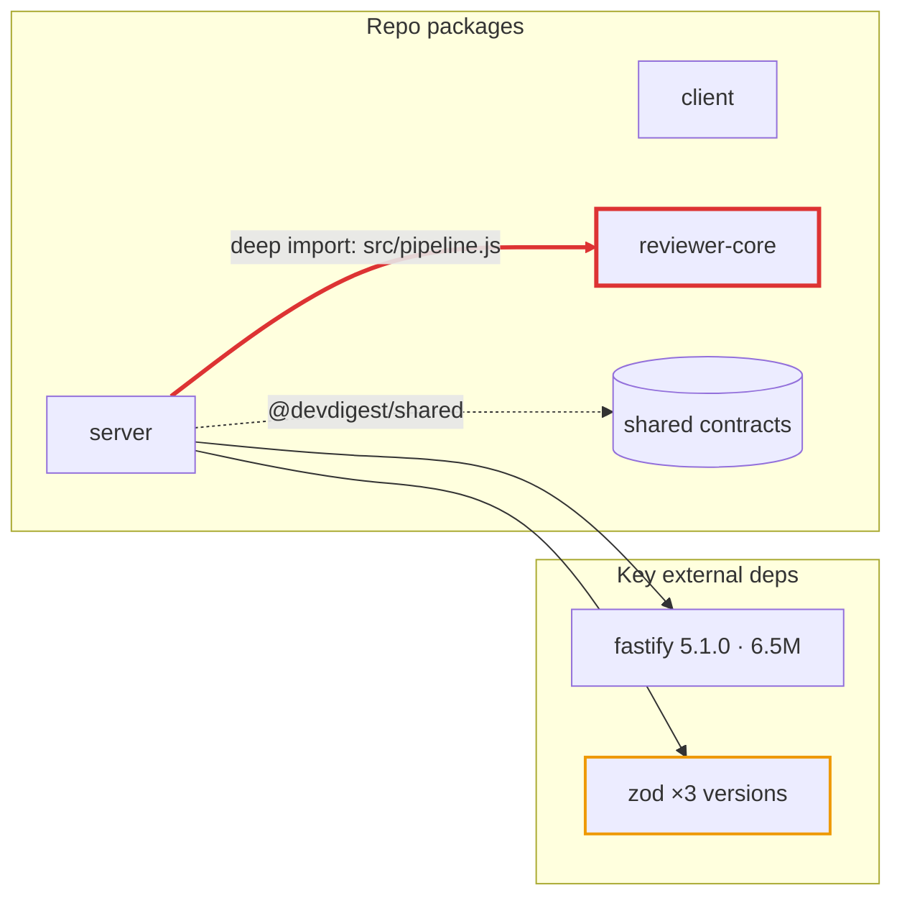

# Report template

The report has exactly these five `##` sections, in this order. Keep the headings verbatim
so the report can be diffed run-to-run.

````markdown
# Dependency Report — <repo or package list> — <YYYY-MM-DD>

## 1. Scope

| Package | Path | PM | Runtime deps | Dev deps | Installed |
|---|---|---|---|---|---|
| @devdigest/api | `server/` | pnpm | 5 | 3 | yes |

- **Measured:** declared deps, installed sizes (`du`), source usage, tsconfig paths, cross-package imports
- **Not measured:** <e.g. `audit`, `outdated` — `--offline`> (or "nothing skipped")

## 2. Dependency Graph



Legend: dashed = internal (tsconfig alias / relative import) · thick red = P0 boundary
violation · orange outline = version drift · solid = external npm dependency.

## 3. Size Breakdown

**Per package** (installed size on disk, not bundle size):

| Package | node_modules total | Heaviest dep | Runtime deps size | Dev deps size |
|---|---|---|---|---|

**Per dependency** — heaviest first:

| Package | Dependency | Version | Type | Category | Installed size | Used? | Notes |
|---|---|---|---|---|---|---|---|
| client | next | 15.0.3 | runtime | framework | 132M | yes | justified |
| server | moment | 2.30.1 | runtime | date | 4.2M | **no** | no import in `server/src` |

## 4. Findings & Priorities

### P0 — fix before the next PR

#### P0-1 · <short title naming the dep / file>
- **Where:** `server/src/services/review-service.ts` → `reviewer-core/src/pipeline.js`
- **Evidence:** <the grep line / version list / size that proves it>
- **Impact:** <what breaks or what it costs>
- **Recommendation:** <one concrete action, with the command and the folder to run it in>
- **Effort:** S | M | L

### P1 — fix this sprint
### P2 — schedule it
### Info — no action needed

(An empty tier is written as "_None._" — never omitted.)

## 5. Summary

1. **P0** — <package/file>: <action> 
2. **P1** — <package/dep>: <action>
3. …  (3–5 items, ordered by priority, each one line, each names a package or file)
````

## Rules for each section

**Scope** — every analyzed package is listed, even if it had no findings. Anything not
measured is named, with the reason.

**Graph**

- `flowchart LR`. One node per repo package; shared contracts as a cylinder `[( )]`.
- External deps: only **runtime** deps plus any dev dep ≥ 50M or involved in a finding. Cap
  around 25 nodes — readability beats completeness; the tables hold the full list.
- Label external nodes `name version · size`. A drifting dep is one node labelled `×N versions`.
- Internal edges `-.->` with the alias or path as the label. P0 edges `==>` plus a red
  `linkStyle`. Never draw a `workspace` edge.
- Node IDs: letters only (`core`, not `reviewer-core`) — put the real name in the label.

**Size Breakdown** — sizes in the unit `du -sh` printed (`K`, `M`, `G`). Unknown = `n/m`.
`Used?` is `yes`, `cli/config` (used only via scripts or config), or **`no`**.

**Findings**

- Ordered P0 → P1 → P2 → Info, and inside a tier by the tie-breakers in SKILL.md.
- IDs `P0-1`, `P1-2`, … so the Summary and follow-up conversations can reference them.
- `Recommendation` that removes or upgrades something is phrased as a proposal to confirm:
  "Recommend removing `moment` from `server/package.json` — confirm, then run
  `pnpm remove moment` in `server/`."
- Internal-dependency findings say "internal (tsconfig alias)" or "internal (relative
  import)" so they are never confused with npm packages.

**Summary** — 3 to 5 items, highest priority first, each referencing a finding ID. No new
information appears here that is not in Findings.
