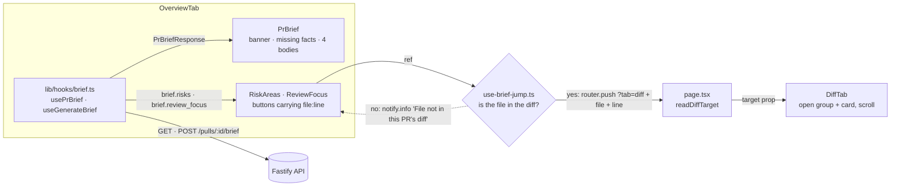
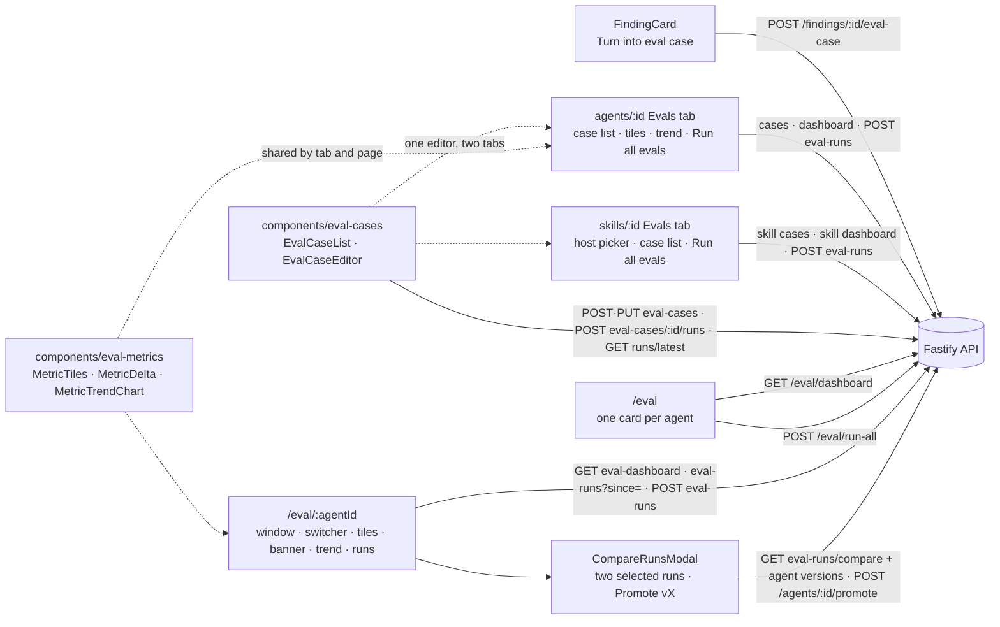

# `@devdigest/web` — the studio (Next.js 15)

The DevDigest UI: import repos, browse pull requests, run and read AI reviews,
author agents, and author reusable **Skills** attached to them. App Router +
React Server/Client components, data via **TanStack Query** hooks over the
Fastify API. (This is the starter surface plus L02's Skills Lab and L06's Eval
screens; course lessons still add Memory, multi-agent, CI, and dashboard screens.)

- **Stack:** Next.js 15 (App Router), React 19, TanStack Query, `next-intl`
  (messages in `messages/<locale>/*.json`), `recharts`, `mermaid`,
  `react-markdown`. UI primitives are vendored under `src/vendor/ui`
  (`@devdigest/ui`) and shared Zod contracts under `src/vendor/shared`
  (`@devdigest/shared`).
- **API base:** `NEXT_PUBLIC_API_BASE` (default `http://localhost:3001`), used by
  `src/lib/api.ts`. Every data hook lives in `src/lib/hooks/*`.
- **Run:** `pnpm dev` (`:3000`). **Test:** `pnpm test` (vitest + jsdom, fetch
  mocked — no API needed). **Typecheck:** `pnpm typecheck`.

## UI route map

Routes (`src/app/**/page.tsx`) and the API surface each leans on (via
`src/lib/hooks/*` → `src/lib/api.ts`):

```mermaid
flowchart TD
  ROOT["/"] -->|"useRepos → GET /repos"| PULLS["/repos/:repoId/pulls<br/>PR list"]
  ONB["/onboarding<br/>add repo"] -->|"POST /repos"| API[("Fastify API")]
  PULLS --> PR["/pulls/:number<br/>review detail<br/>(overview · diff · findings)"]

  AGENTS["/agents"] --> AGENT["/agents/:id<br/>editor (config · skills · context · evals)"]
  SKILLS["/skills<br/>Skills Lab"] --> SKILL["/skills/:id<br/>editor (config · preview · versions · stats · context · evals)"]
  CONV["/repos/:repoId/conventions<br/>Conventions (scan · accept/reject/edit · create skill)"]
  CTX["/repos/:repoId/context<br/>Project Context (clone Markdown; author under .devdigest/specs/)"]
  SETTINGS["/settings/:section<br/>API keys · models"]
  EVAL["/eval<br/>Eval Dashboard"] --> EVALAGENT["/eval/:agentId<br/>tiles · trend · runs · Compare"]

  PULLS -->|"GET /repos/:id/pulls · /repos/:id/index-state"| API
  PR -->|"GET /pulls/:id · /reviews · /pulls/:id/comments · /pulls/:id/blast-radius · /pulls/:id/history · /pulls/:id/brief<br/>POST /pulls/:id/review · /pulls/:id/brief · /findings/:id/(accept|dismiss)"| API
  AGENTS -->|"/agents · /agents/:id · /agents/:id/skills/:skillId"| API
  SKILLS -->|"/skills · /skills/:id/(versions|restore|agents|stats) · /skills/import(/preview) · /skills/import/url(/preview)"| API
  CONV -->|"GET /repos/:id/conventions · POST …/extract · PATCH …/:candidateId · POST …/skill(/preview)"| API
  CTX -->|"GET /repos/:id/context · /repos/:id/context/file?path="| API
  AGENT -->|"Context tab: GET|PUT /agents/:id/context?repoId="| API
  SKILL -->|"Context tab: GET|PUT /skills/:id/context?repoId="| API
  SETTINGS -->|"/settings · /providers"| API
  PR -->|"POST /findings/:id/eval-case"| API
  AGENT -->|"Evals tab: GET /agents/:id/eval-cases · /eval-dashboard · POST …/eval-runs · POST /agents/:id/eval-cases · PUT·DELETE /eval-cases/:id · POST /eval-cases/:id/runs · GET /eval-cases/:id/runs/latest"| API
  SKILL -->|"Evals tab: GET /skills/:id/eval-cases · /eval-dashboard · POST /skills/:id/eval-cases · POST …/eval-runs · the case routes above"| API
  EVAL -->|"GET /eval/dashboard"| API
  EVALAGENT -->|"GET /agents/:id/eval-dashboard · /eval-runs · /eval-runs/compare?a=&b="| API
```

Cross-cutting chrome lives in `src/components/app-shell` (nav, breadcrumbs,
`g`-then-key shortcuts). Pages are thin; feature logic sits in colocated
`_components/<Name>/` folders, each with its own `*.test.tsx`.

## Project Context

Server side: `server/src/modules/project-context/README.md`.

- **Page** `/repos/:repoId/context` (`ProjectContextView`) lists the clone's
  Markdown files on the left (toolbar: New file, New folder, Upload, Refresh) and
  shows the selected document on the right with how many agents use it. Files
  under `.devdigest/specs/` can be created, uploaded, edited (Preview | Edit),
  saved and deleted; every other file, and any tracked or over-64 KB one, is
  Preview only with a "read-only" reason. Saves carry the file's version token: a
  stale write is a 409 the page resolves with Reload or Overwrite, keeping the
  user's text. The write hooks (`useCreateContextFile`, `useUploadContextFile`,
  `useSaveContextFile`, `useDeleteContextFile`) set `meta.inlineError`, so the
  global mutation toast skips them and the page shows the error inline. Its nav
  entry is in `src/vendor/ui/nav.ts`.
- **Unsaved-changes guard** (`src/providers/navigation-guard.tsx`): while a draft
  is dirty the page registers a blocker. It asks for confirmation on same-origin
  link clicks (a capture-phase click listener), on the six `router.push` sites in
  the app shell hooks (`useGlobalShortcuts`, `useShellCommands`,
  `useShellContext`), on reload and on closing the tab (`beforeunload`).
  **Limitation:** browser Back/Forward is not guarded, so a Back press with unsaved
  edits loses them silently.
- **`src/components/context-docs-picker`** is the shared attach/reorder list
  (filter, a 560 px preview drawer that can also attach, drag or ArrowUp/Down on
  the handle to reorder attached rows, per-row token counts with "—" when unknown,
  a total with an "over 4K soft cap" badge, and a "No documents found" empty state
  with Refresh). It holds no mutation; the caller passes `attached`, `onChange`
  and `listState.onRefresh`.
- **Context tabs** wrap the picker over `useContextFiles` and the attachment
  hooks in `src/lib/hooks/project-context.ts`: the Agent editor's tab
  (`AgentEditor/_components/ContextTab`) and the Skill editor's tab
  (`SkillEditor/_components/ContextTab`), which also notes that agents using the
  skill inherit its documents and shows a SERIALIZES AS box: the
  `## Project context` heading, then the attached paths that are present in the
  listing, in attach order, each with its kind. Both act on the active repo.
- **Run trace:** the prompt block for this slot is labelled "Project context —
  attached specs (untrusted)" (`messages/en/runs.json`, `trace.prompt.specs`),
  and the trace's `specs_read` lists the injected paths.

## PR Brief

Server side: `server/src/modules/brief/README.md`. The brief is the top of a PR's
Overview tab: a summary, **Risk areas** and **Review focus — read these first**,
each pointing at a file in Files changed. Opening the tab never calls the model;
only Generate, the refresh button and Retry do.

- **Which body shows** is `briefView` in `PrBrief/helpers.ts`, with the precedence
  generating → error → ready → empty. A 409 from this tab followed by the server
  reporting `generating` therefore renders only the skeleton.
- **No extra polling while waiting.** `usePrBrief` refetches every 3 s only when
  the response says `generating` (another tab, or a revisit); the tab that sent
  the POST shows its skeleton from `mutation.isPending` and stores the POST
  response directly (`lib/hooks/brief.ts`).
- **`OverviewTab` owns the hooks and `PrBrief` takes props.** The Risk areas and
  Review focus cards need the same brief, and they are shown only for a stored
  brief that is not being regenerated.
- **A jump is a navigation, not a callback chain.** `use-brief-jump.ts` strips a
  leading `./` and a trailing `:line` / `:a-b` from the ref (`diff-target.ts`),
  and compares the path to the PR's changed files exactly, case-sensitively. A
  match is `router.push`, so Back returns to Overview and reload keeps the
  target. A blast-map file that is not part of the diff stays on Overview with the
  notice. `page.tsx` clears `file` and `line` when the tab is switched by hand.
- **`DiffTab` acts on the target once the layout has settled.** It waits for
  Smart Diff to resolve (files change group when it does), opens the target's
  group (`DiffGroup`) and card, marks the card, then scrolls to the
  `data-new-line` row, or to the card top when that line is not rendered. A
  target that is not in the diff marks and scrolls nothing.
- **Missing inputs are shown, not hidden.** Each `missing_facts` entry from the
  server maps to a line in `messages/en/brief.json` (`missingFacts.*`);
  `PrBrief/missing-facts.test.ts` pins that table to `BRIEF_FACT_PAIRS` in the
  shared contract, in both directions.

## Eval

Server side, scoring rules and error codes: `server/src/modules/evals/README.md`. The
client shows what the server computes; it scores nothing. All data goes through
`src/lib/hooks/evals.ts` (query-key builders are exported there).

- **Where a case is made.** `FindingsPanel` owns the create mutation and passes the card
  `evalAvailable`, which `ReviewRunAccordion` sets only when the review has an agent that still
  exists (`agent_id` and `agent_name` both set). The Files-changed tab renders cards without
  the action. The button is enabled only for an accepted or dismissed finding; a 422 with
  `details.reason === 'diff_too_large'` gets its own message, any other failure a generic one
  (`FindingsPanel/helpers.ts`, `evalStatusForError`).
- **A case can also be written by hand.** `EvalCaseEditor` (`src/components/eval-cases/`) is a
  modal with the name, a Diff / Files / PR meta tab group, and on the right the expectation,
  file, line range and an expected-output JSON box. `EvalCaseList` renders the rows, each with
  an origin badge (`from finding` / `manual`), the suite `last_result`, and, when the server
  sends `latest_single`, a secondary `single run: <result>` marker. Both are shared by the agent
  and the skill Evals tabs, so they live in `src/components`, not under either route.
  - *The form is the source of truth.* The JSON text is derived from the fields
    (`{ type, file, start_line, end_line }`) until the user types in it. A JSON edit that
    parses and fits the shape updates the fields; one that does not leaves the fields at their
    last valid values, shows the reason and disables Save (`expectation-json.ts`).
  - *Validation is the server's.* The shape and size rules come from `EvalCaseInput.safeParse`
    and `EVAL_CASE_LIMITS` in `@devdigest/shared`. The diff rules are `parsePastedDiff`
    (`case-diff.ts`), which mirrors the server's `pastedDiffFiles` rule for rule and is pinned by
    the same fixtures: a "changed line" is the new-side number of a `+` line, and a multi-file
    diff without `diff --git` lines is rejected. The Files tab lists each file's changed ranges,
    read only; the file field offers only those files, and **Finding skeleton** fills the first
    file's first range. The name-clash check reads the other cases' names from the list.
  - *Running.* **Run case** is disabled until the case is saved and while its run is live. **Run on
    save** is a toggle, off by default. The editor only reports the saved case id (`onRun`); the
    tab decides how the run starts. `useEvalCaseRunState` polls while a single run is live and
    feeds the editor's last-run panel (kind, agent version, result, expected vs got, duration,
    cost, error).
  - *Closing.* The X, the backdrop, Cancel and Escape ask before discarding unsaved changes.
    Editing the expectation or target of a case made from a finding shows a warning; the case
    keeps its origin and its source-finding link.
- **The skill Evals tab** (`skills/[id]` → `evals`) has the same list, editor and tiles. A skill
  has no model, so **Run all evals** and each row's Run first open `HostPickerModal`, listing the
  agents the skill is linked to (`useSkillAgents`); it preselects the host of the latest run
  while that agent is still linked, otherwise the first. With no linked agent, Run is disabled
  and the tab says a host agent is needed. The tiles come from `useSkillEvalDashboard`. Skill
  runs appear on this tab only, never on the agent's tab or the Eval Dashboard.
- **A run is a poll.** `POST …/eval-runs` returns the `running` run at once; the run list and the
  agent dashboard refetch every 2 s while one is `running`. The Run button stays disabled until
  it ends, and on the agent tab a 409 on a suite run only triggers a refetch, with no error text
  (the skill tab shows `evals.runConflict`). A 409 on a single-case run shows "This case is
  already running." (`caseEditor.runConflict`) on both tabs.
- **"Not available" is "—", never 0.** Metrics are nullable in the contract. `MetricTrendChart`
  (`src/components/eval-metrics/`, shared by the agent page and the agent Evals tab) uses
  `recharts` directly with `connectNulls={false}`, because the vendored `LineChart` plots a
  missing value as 0. It draws every point it is given (no cap), is keyboard-focusable
  (`accessibilityLayer`), and its tooltip shows the run date, agent version and cost ("—" when
  unknown). The agent Evals tab renders it under the tiles with the whole `dashboard.trend`
  (every completed agent-owned suite run, at most the newest 500; single-case and skill runs are
  not in it); the agent page passes it the same list filtered by the window.
- **Time window and agent switcher** (`/eval/:agentId`). The window (`7d`, `30d`, `90d`, `all`;
  default `30d`, anything else falls back to it) and the agent live in the URL: picking a window
  `replace`s `?window=` (`WindowSelect`), `AgentSwitcher` `push`es `/eval/<id>?window=<w>` so Back
  returns to the previous agent, and a reload restores both. The runs table reads `eval-runs?since=`; the trend is
  `dashboard.trend` filtered by `ran_at` on the client; the tiles and the regression banner always
  read the unfiltered dashboard (the latest two runs). An empty window shows one empty state with
  **Show all runs**. An agent id that is unknown or has no case redirects to
  `/eval?notice=agent_not_found`, which the landing page renders as a status notice (any other
  `notice` value is ignored). The page header also has **Run eval** and the agent's current version.
- **Run all agents** (`/eval`). The button opens `RunAllAgentsModal`: every eligible agent (enabled,
  at least one case) with its case count and latest cost, the paid-call total and an estimate ("—"
  for an agent never run; the total is "—" only when no cost is known). Confirming posts
  `/eval/run-all` and the modal lists one text line per agent, `started` or `skipped` with its
  reason. With no eligible agent the button is disabled and says why. A card shows a **Running**
  badge while the server reports `running`, and the landing page polls while any card is running.
- **Promote vX** (Compare). Each compared run has a **Promote v{n}** button, disabled with
  "Current configuration" when its recorded configuration equals the agent's, or with a reason when
  its snapshot cannot be read (the metric rows stay). The confirmation lists each changed field and
  skill change, the skills that no longer exist, and a skill whose version moved (only the link is
  restored). It posts `expected_version`, captured when Compare opened; a 409 shows a reload
  message and nothing changes. On success Compare closes and a toast names the new version.
- **Change is text, not colour.** `MetricDelta` renders a sign glyph and a unit (`▲ +3.0 pts`,
  `+2 cases`); the vendored `MetricCard.delta` is not used because it is unsigned and icon-only.
- **Compare** is enabled for exactly two selected runs, and only `completed` and `partial` runs
  are selectable. The prompt diff comes from the two agent versions (`useAgentVersion`) run
  through `diffLines`, which lives in `src/components/diff-viewer/line-diff.ts` since the
  skill Versions tab became its second user. If either version cannot be read, the metrics
  still show and the diff is replaced by a notice.
- **Nav.** The sidebar entry is in `src/vendor/ui/nav.ts` (key `eval`, under Skills Lab).
- **The contracts are mirrored.** `client/src/test/eval-contract-sync.test.ts` fails if
  `contracts/eval-ci.ts` or `contracts/knowledge.ts` differs from the server copy.

## Testing

Component/interaction tests (`*.test.tsx`) run under vitest + jsdom with `fetch`
mocked, so they need neither the API nor a browser. The real browser journeys
(client + API + seeded DB) are covered by the deterministic agent-browser suite
in [`../e2e`](../e2e/README.md) and the `e2e-web.yml` workflow. See
[`../TESTING.md`](../TESTING.md).
