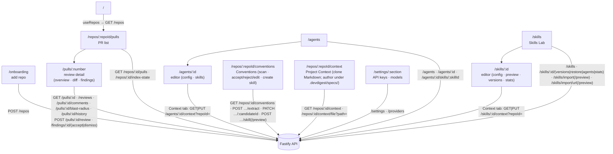

# `@devdigest/web` — the studio (Next.js 15)

The DevDigest UI: import repos, browse pull requests, run and read AI reviews,
author agents, and author reusable **Skills** attached to them. App Router +
React Server/Client components, data via **TanStack Query** hooks over the
Fastify API. (This is the starter surface plus L02's Skills Lab; course lessons
still add Memory, Eval, Blast/Brief, multi-agent, CI, and dashboard screens.)

- **Stack:** Next.js 15 (App Router), React 19, TanStack Query, `next-intl`
  (messages in `messages/<locale>/*.json`), `recharts`, `mermaid`,
  `react-markdown`. UI primitives are vendored under `src/vendor/ui`
  (`@devdigest/ui`) and shared Zod contracts under `src/vendor/shared`
  (`@devdigest/shared`).
- **API base:** `NEXT_PUBLIC_API_BASE` (default `http://localhost:3001`), used by
  `src/lib/api.ts`. Every data hook lives in `src/lib/hooks/*`.
- **Run:** `pnpm dev` (`:3000`). **Test:** `pnpm test` (vitest + jsdom, fetch
  mocked — no API needed). **Typecheck:** `pnpm typecheck`.

## UI route map

Routes (`src/app/**/page.tsx`) and the API surface each leans on (via
`src/lib/hooks/*` → `src/lib/api.ts`):

Cross-cutting chrome lives in `src/components/app-shell` (nav, breadcrumbs,
`g`-then-key shortcuts). Pages are thin; feature logic sits in colocated
`_components/<Name>/` folders, each with its own `*.test.tsx`.

## Project Context

Server side: `server/src/modules/project-context/README.md`.

- **Page** `/repos/:repoId/context` (`ProjectContextView`) lists the clone's
  Markdown files on the left (toolbar: New file, New folder, Upload, Refresh) and
  shows the selected document on the right with how many agents use it. Files
  under `.devdigest/specs/` can be created, uploaded, edited (Preview | Edit),
  saved and deleted; every other file, and any tracked or over-64 KB one, is
  Preview only with a "read-only" reason. Saves carry the file's version token: a
  stale write is a 409 the page resolves with Reload or Overwrite, keeping the
  user's text. The write hooks (`useCreateContextFile`, `useUploadContextFile`,
  `useSaveContextFile`, `useDeleteContextFile`) set `meta.inlineError`, so the
  global mutation toast skips them and the page shows the error inline. Its nav
  entry is in `src/vendor/ui/nav.ts`.
- **Unsaved-changes guard** (`src/providers/navigation-guard.tsx`): while a draft
  is dirty the page registers a blocker. It asks for confirmation on same-origin
  link clicks (a capture-phase click listener), on the six `router.push` sites in
  the app shell hooks (`useGlobalShortcuts`, `useShellCommands`,
  `useShellContext`), on reload and on closing the tab (`beforeunload`).
  **Limitation:** browser Back/Forward is not guarded, so a Back press with unsaved
  edits loses them silently.
- **`src/components/context-docs-picker`** is the shared attach/reorder list
  (filter, a 560 px preview drawer that can also attach, drag or ArrowUp/Down on
  the handle to reorder attached rows, per-row token counts with "—" when unknown,
  a total with an "over 4K soft cap" badge, and a "No documents found" empty state
  with Refresh). It holds no mutation; the caller passes `attached`, `onChange`
  and `listState.onRefresh`.
- **Context tabs** wrap the picker over `useContextFiles` and the attachment
  hooks in `src/lib/hooks/project-context.ts`: the Agent editor's tab
  (`AgentEditor/_components/ContextTab`) and the Skill editor's tab
  (`SkillEditor/_components/ContextTab`), which also notes that agents using the
  skill inherit its documents and shows a SERIALIZES AS box: the
  `## Project context` heading, then the attached paths that are present in the
  listing, in attach order, each with its kind. Both act on the active repo.
- **Run trace:** the prompt block for this slot is labelled "Project context —
  attached specs (untrusted)" (`messages/en/runs.json`, `trace.prompt.specs`),
  and the trace's `specs_read` lists the injected paths.

## Testing

Component/interaction tests (`*.test.tsx`) run under vitest + jsdom with `fetch`
mocked, so they need neither the API nor a browser. The real browser journeys
(client + API + seeded DB) are covered by the deterministic agent-browser suite
in [`../e2e`](../e2e/README.md) and the `e2e-web.yml` workflow. See
[`../TESTING.md`](../TESTING.md).
