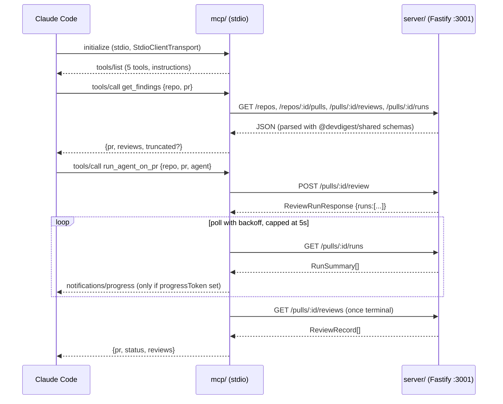

# @devdigest/mcp

A local **stdio MCP server** named `devdigest`. It is a thin HTTP adapter over
the existing Fastify API (`server/`, default `http://localhost:3001`) and
exposes five tools to Claude Code as `mcp__devdigest__<tool>`:
`list_agents`, `run_agent_on_pr`, `get_findings`, `get_conventions`, and
`get_blast_radius`.

It never imports server runtime code. The only cross-package import is the
`@devdigest/shared` Zod contracts (via a tsconfig path alias, the same way
`reviewer-core` uses them) — used to parse API responses. It assumes the API
is already running; it never starts, health-checks or supervises it.

## Architecture



Everything below `MCP` in that diagram is HTTP — the process has no other way
to reach the API. Everything above it is JSON-RPC over stdio; `stdout` carries
only that protocol (see [Conventions](AGENTS.md#conventions)).

## Tools

| Tool | Args | Returns (shape) | Annotations |
|---|---|---|---|
| `list_agents` | *(none)* | `{ agents: [{ id, name, description, provider, model, enabled }] }`, or `{ agents: [], hint }` when none are enabled | `readOnlyHint: true`, `idempotentHint: true`, `openWorldHint: false` |
| `run_agent_on_pr` | `repo`, `pr`, `agent` (name / id / `"all"`), `response_format` | Terminal: `{ pr, status: "done"\|"partial"\|"failed", attached?, reviews, truncated? }`. Wait-limit: `{ pr, status: "running", run_ids, waited_s, hint }` | `readOnlyHint: false`, `destructiveHint: false`, `idempotentHint: false`, `openWorldHint: false` |
| `get_findings` | `repo`, `pr`, `agent?`, `run_id?`, `response_format` | `{ pr, reviews, in_progress?, truncated? }`, or a `running`/`hint` shape when nothing has finished yet | `readOnlyHint: true`, `idempotentHint: true`, `openWorldHint: false` |
| `get_conventions` | `repo`, `status` (`accepted \| pending \| any`, default `any`) | `{ repo, scan, candidates, rejected_count, truncated? }` | `readOnlyHint: true`, `idempotentHint: true`, `openWorldHint: false` |
| `get_blast_radius` | `repo`, `pr` | `{ pr, head_sha, summary, degraded?, reason?, hint?, changed_symbols, downstream, truncated? }`, via `GET /pulls/:id` + `GET /pulls/:id/blast-radius`, read-only | `readOnlyHint: true`, `idempotentHint: true`, `openWorldHint: false` |

None of the five declares `outputSchema` — see [No
`outputSchema`](#no-outputschema-on-any-tool). `repo` accepts `"owner/name"`
or a repo id; `pr` accepts a PR number, `"#482"`, or a PR id. Full argument
descriptions (the `.describe()` text that ships in `tools/list`) live in
[`../specs/06-mcp-server.md`](../specs/06-mcp-server.md) → *Final tool
descriptions* — that section is canonical (for `get_blast_radius` and the
server `instructions` it is [`../specs/07-blast-radius.md`](../specs/07-blast-radius.md)
→ *MCP tool: final strings*); this table is a map onto it, not a second copy to
keep in sync.

## Environment

| Variable | Default | Meaning |
|---|---|---|
| `DEVDIGEST_API_URL` | `http://localhost:3001` | Base URL of the running DevDigest API. Trailing `/` is stripped. |
| `DEVDIGEST_MCP_WAIT_MS` | `600000` (10 min) | How long `run_agent_on_pr` polls before returning `status: "running"` instead of the result. Range 5,000–3,600,000. |
| `DEVDIGEST_MCP_POLL_MS` | `2000` | Starting poll interval for `run_agent_on_pr`; grows ×1.5 per poll, capped at 5,000 ms. Minimum 500. |

`.mcp.json` sets only `DEVDIGEST_API_URL` — the other two are optional
overrides for a shell running `npm run inspect` or the real server directly.
An invalid value throws `Invalid DEVDIGEST_* environment: <var names>` with no
values in the message (`src/config.ts`).

## Running it

### As a Claude Code project MCP server

The committed root [`.mcp.json`](../.mcp.json) declares `devdigest` as a
`stdio` server:

```json
{
  "mcpServers": {
    "devdigest": {
      "type": "stdio",
      "command": "node",
      "args": [
        "${CLAUDE_PROJECT_DIR}/mcp/node_modules/tsx/dist/cli.mjs",
        "--tsconfig", "${CLAUDE_PROJECT_DIR}/mcp/tsconfig.json",
        "${CLAUDE_PROJECT_DIR}/mcp/src/index.ts"
      ],
      "env": { "DEVDIGEST_API_URL": "${DEVDIGEST_API_URL:-http://localhost:3001}" }
    }
  }
}
```

1. `./scripts/dev.sh` (Postgres + API + web), then `cd mcp && npm ci`.
2. Open Claude Code at the repo root and approve the project server when
   prompted.
3. `/mcp` should show `devdigest` connected with 5 tools.
4. `/context` shows what those 5 tools cost against the session's token
   budget — there is no fixed number here because it depends on the
   installed Claude Code version's own overhead; measure it yourself and
   record what you saw in `INSIGHTS.md`.

If `${CLAUDE_PROJECT_DIR}` is not expanded by the installed Claude Code
version (`/mcp` shows the server failed, or a missing-variable warning),
replace the three paths with repo-relative `mcp/...` paths — Claude Code
starts project servers from the project root, so the relative form works
too. Record which shape this installation needed in `INSIGHTS.md`.

Two client-side knobs matter if a tool call looks like it hung or was cut
short:
- **`MCP_TOOL_TIMEOUT`** (ms) — how long Claude Code waits for a single tool
  call before giving up. `run_agent_on_pr` is designed to return
  `status: "running"` on its own before `DEVDIGEST_MCP_WAIT_MS` elapses, but
  if the client's own timeout is shorter than that, lower
  `DEVDIGEST_MCP_WAIT_MS` or raise `MCP_TOOL_TIMEOUT`.
- **`MAX_MCP_OUTPUT_TOKENS`** — Claude Code's cap on a single tool result
  (25k tokens by default). `format.ts`'s `MAX_OUTPUT_CHARS` guard
  (≈10k tokens) stays well under it by design, so a single call should never
  hit this ceiling.

### Manual smoke test (the MCP Inspector)

```sh
cd mcp && npm ci
npm run inspect
```

This runs `@modelcontextprotocol/inspector` against `src/index.ts` through the
tsx CLI (the same launch shape as `.mcp.json`) so you can call each tool by
hand against a seeded repo, e.g. `acme/payments-api` PR `482`.

## Design decisions

- **`run_agent_on_pr` returns a result, not an operation handle.** The tool
  description promises "wait for its verdict, score and findings" — an agent
  reading the tool list should not have to learn a separate poll-for-result
  tool. If the wait limit passes first, the tool returns
  `status: "running"` with `run_ids` and tells the caller to use
  `get_findings` — never to call `run_agent_on_pr` again for the same run.
- **Attach-to-in-flight.** Before starting a review, `run_agent_on_pr` checks
  for a running run on the same agent (or, for `"all"`, any running run) and
  attaches to it instead of starting a second one. A client that hit its own
  timeout and retries the same call would otherwise burn a second LLM call
  and a second slot of the API's 10/min review rate limit for no reason.
- **Truncation caps, not unlimited output.** `format.ts` caps findings and
  convention candidates (`MAX_FINDINGS_CONCISE`, `MAX_FINDINGS_DETAILED`,
  `MAX_LIST`) globally across agents, by severity, and adds a `truncated`
  block naming how to narrow the query (`agent`, `run_id`). A hard character
  guard (`MAX_OUTPUT_CHARS`) then halves the shown findings until the
  serialized result fits, so one call can never blow the client's own output
  budget.
- **No `outputSchema` on any tool.** An `outputSchema` adds bytes to every
  `tools/list` response for every session, whether or not the tool is ever
  called.
- **tsx at runtime, not a `dist/` build.** `tsc` does not rewrite the
  `@devdigest/shared` path alias, so a compiled `dist/` would not resolve it
  without adding a bundler — a new dependency this package does not need.
  The repo already runs TypeScript source directly through tsx elsewhere
  (`server/package.json`'s `dev` script), and `reviewer-core` never emits
  either. The cost is one extra process start-up (~0.5s) and a dependency on
  tsx resolving the `zod` path alias from `mcp/node_modules` with
  `server/node_modules` absent — `test/stdio.test.ts` is the proof, in CI,
  that this holds.

## Blast radius

`get_blast_radius` calls `GET /pulls/:id` before `GET /pulls/:id/blast-radius`
— the same refresh the studio's Overview tab triggers by loading the PR
detail first — so the changed-file list the index read is scoped to is
current, not whatever the API last persisted. Both calls are GETs; the tool
never re-indexes or triggers a scan. `format.ts`'s `shapeBlastRadius` caps
`changed_symbols` (`MAX_BLAST_SYMBOLS`) and `downstream` (`MAX_BLAST_DOWNSTREAM`)
independently of the server's own per-symbol caller cap, and a degraded index
(off, failed, partial, or never indexed) is a normal result — `degraded`,
`reason` and a `hint` naming the reason, never `isError`. See
[`specs/07-blast-radius.md`](../specs/07-blast-radius.md) for the route and
the mapping rules behind the shape.

## SSE: a later upgrade

`run_agent_on_pr` polls `GET /pulls/:id/runs` with backoff rather than
consuming `GET /runs/:id/events` (`server/src/modules/reviews/routes.ts:48`).
Polling needed no new transport code and stays inside the "no SSE, no HTTP
transport" scope of this package's first version. If polling overhead or
latency becomes a real problem, the natural next step is an SSE-consuming
`waitForRuns` behind the same `{ state, runs }` return shape — the tool
handlers would not need to change.

## Troubleshooting

- **A tool call fails with "not reachable at `<origin>`"** — the API is not
  running. Start it with `./scripts/dev.sh` (or `cd server && pnpm dev`), then
  retry; this package never starts it for you.
- **Every tool call fails the same way, right after a fresh clone or pull** —
  you likely forgot `cd mcp && npm ci`. `.mcp.json` launches
  `node .../tsx/dist/cli.mjs …` directly with no install step, so a missing
  `mcp/node_modules` looks like a total regression rather than a setup step
  (see `e2e/INSIGHTS.md` for the same class of symptom in that package).
- **"not reachable" even though the API is clearly running (Windows)** —
  `localhost` can resolve to `::1` first while the API binds IPv4
  (`server/src/server.ts`). Set
  `DEVDIGEST_API_URL=http://127.0.0.1:3001`.
- **`/mcp` shows `devdigest` failed to start, or a missing-variable
  warning** — see the `${CLAUDE_PROJECT_DIR}` fallback above; switch
  `.mcp.json` to repo-relative `mcp/...` paths.
- **A rate-limit error on `run_agent_on_pr`** — `POST /pulls/:id/review` is
  capped at 10/min and shares the API's global 120/min limit with the studio
  UI. Wait a minute and retry; the tool's own backoff already grows to 5s
  between polls to stay well under that limit.
- **`run_agent_on_pr` returns `status: "running"` instead of a result** — the
  wait limit (`DEVDIGEST_MCP_WAIT_MS`) passed before every run reached a
  terminal state. Call `get_findings` with the returned `run_id` later; do
  not call `run_agent_on_pr` again for the same review.
