# `@devdigest/reviewer-core` — the review engine

Pure review logic: **diff → prompt → LLM → grounded findings**. No database,
GitHub, or filesystem; the only side effect is an LLM call through an **injected**
`LLMProvider`, which is what makes it mock-testable.

In the starter the **server** (`@devdigest/api`) is its only consumer — for local
reviews in the studio. (The CI runner that runs the same engine in GitHub Actions
is added back in the Export-to-CI lesson, L06.) The server wires it via a tsconfig
path alias (`@devdigest/reviewer-core` → `../reviewer-core/src`) and consumes the
TypeScript **source** directly (tsx in dev, vitest in tests). The package never
emits JS — its `build` is a type-check.

## Pipeline

```mermaid
flowchart LR
  IN["inputs<br/>diff · system prompt · repo map · derived intent"] --> PROMPT["assemblePrompt()<br/>prompt.ts"]
  PROMPT --> WRAP["wrapUntrusted() + INJECTION_GUARD<br/>fence untrusted content vs prompt injection"]
  WRAP --> LLM["LLMProvider (injected)<br/>llm/openrouter.ts"]
  LLM --> STRUCT["structured output<br/>llm/structured.ts<br/>Zod → JSON Schema · parse-with-repair"]
  STRUCT --> GROUND["groundFindings()<br/>grounding.ts<br/>mechanical citation gate vs the diff"]
  GROUND --> SCOPE["filterByScope()<br/>review/scope.ts<br/>drop out_of_scope, non-CRITICAL only"]
  SCOPE --> OUT["Review<br/>verdict · score · grounded, in-scope findings"]
```

The grounding step is the mandatory gate: a finding that doesn't cite a real line
in the diff is dropped, so the engine can't hallucinate locations. Immediately
after it, a SEPARATE gate — `filterByScope()` (`review/scope.ts`, L03) — drops a
finding the reviewer itself labelled `Finding.scope === 'out_of_scope'`, but
**only** when its severity isn't `CRITICAL` and **only** when the caller supplied
an `intent` block at all (`grounding.ts` is never opened by this gate). The score
is recomputed deterministically from the findings that survive **both** gates,
not trusted from the model. `review/run.ts` orchestrates the run (single-pass by
default).

The engine also accepts optional prompt slots the **course lessons** feed it —
`memory` (L07), `specs` (L05), `callers` — plus a `reduce()`/map-reduce path and
a `toReview()` CI payload helper used from L06. **`intent` (L03) is now fed**:
the server derives a PR's intent/scope (`modules/intent/`, ring 2, resolved
through `container.intent`) and passes the resulting text as
`ReviewInput.intent`; `assemblePrompt` renders it as `## Derived intent`,
`wrapUntrusted`-wrapped, right after `## PR description` — it is a claim ABOUT
the PR, so it sits beside the author's own claim, before the sections that are
the reviewer's instructions and evidence. Empty/undefined → the section is
omitted byte-identically, same contract as every other optional slot. **`skills`
(L02) is now fed**:
the server resolves an agent's enabled, ordered skill bodies
(`SkillsRepository.blocksForAgent`) and spreads them in at the
`reviewPullRequest` call site (`modules/reviews/run-executor.ts`); nothing in
this package changed to receive them — the slot, its section heading, and the
omit-when-empty behavior were already correct, which is the whole point of a
slot no lesson has fed yet. Any body whose `source !== 'manual'` arrives already
wrapped with `wrapUntrusted()` — the server decides that, since provenance is a
database concept this package deliberately doesn't know about. In the starter
(no skill linked) the server passes only the diff, system prompt, and repo map;
the extra slots are omitted, so `assemblePrompt` simply leaves those sections
out — unchanged, byte for byte.

## Public API

Exported from `src/index.ts`: `assemblePrompt` / `wrapUntrusted` (prompt),
`groundFindings` / `groundingSummary` (grounding), `filterByScope` (scope, L03),
`toJsonSchema` / `extractJson` / `parseWithRepair` (structured output), plus the
`run` entrypoint and `reduce`. Contracts (`Review`, `Finding`, `Verdict`, …)
come from `@devdigest/shared`.

## Testing

`npm test` (vitest) — hermetic units with a stubbed `LLMProvider`: prompt
assembly, the grounding gate, `toReview` selection, and a full `run`. No keys,
no network. `npm run typecheck` doubles as the build. See
[`../TESTING.md`](../TESTING.md).
