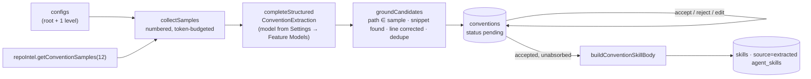

# `conventions` — the house-rules extractor

Reads a small, code-selected sample of an indexed repo, asks one cheap model for
convention candidates, verifies every citation in code, lets a human accept /
reject / edit each one, and turns the accepted set into one `repo-conventions`
skill bound to the chosen agents. Spec: [`../../specs/03-conventions-module.md`](../../specs/03-conventions-module.md)
(cross-package: [`../../../specs/04-conventions-extractor.md`](../../../specs/04-conventions-extractor.md)).

## Non-obvious rules

- **Sample selection never calls a model.** Config files are context for what
  tooling already enforces, so the model can leave lint-shaped rules out.
  Lines are numbered before they are sent — that is what makes a citation
  checkable.
- **The gate is code.** A candidate survives only if its path is one we
  sampled and its snippet is really on some line of that file; the stored
  `evidence_line` is where it was found, not what the model said.
- **Decisions outlive scans.** A rescan deletes only `pending` rows; a
  survivor whose normalised rule matches an accepted or rejected row is
  dropped as a duplicate, so a rejection never comes back and an edit is never
  overwritten.
- **A `running` scan is a lock** (409); one older than `SCAN_STALE_MS` is
  failed first so a crash cannot lock a repo forever.
- **The extracted skill's rules are trusted, its evidence is wrapped.** Every
  rule passed a human Accept and the body was shown editable, so
  `run-executor.buildSkillBlocks` does not wrap `source: 'extracted'` bodies;
  each evidence snippet is wrapped individually by the body builder.
- `resolveFeatureModel` lives in `modules/_shared/` so this module (and any
  other) can read the Settings choice without a cross-module import.

## Errors the client branches on

| `code` | status | when |
|---|---|---|
| `scan_running` | 409 | a scan for this repo is still `running` |
| `repo_not_cloned` | 422 | `repos.clone_path` is null, or no sampled file could be read |
| `repo_not_indexed` | 422 | `getConventionSamples` returned nothing (index first) |
