# `evals` — cases from decided findings, suite runs, code-scored metrics

`evals` answers one question: **did this edit to an agent make its reviews better or
worse?** A person accepts or dismisses a finding on a pull request and turns it into an
**eval case**. A **suite run** then replays every case of one agent against the agent's
current prompt, model and skills, and a pure function scores the result. Runs are stored,
so two of them can be compared. It is a *reference + explanation* document: the data
model and routes, then why each step is shaped the way it is.

The split that shapes the module: **the model only reviews; code decides pass or fail.**
There is no judge model. A case is a file, a line range and an expectation, and a finding
either overlaps that range or it does not (`helpers.ts`, `findingMatches`).

The module is a default Fastify plugin registered in `modules/index.ts`. `routes.ts`
builds `EvalsService` once with a deps object (the `brief` precedent) and lazy ports
(`container.agentsRepo`, `container.skillsRepo`, `container.git`, `container.llm`), read per
call so a test that patches the container after `buildApp()` is honoured. The service
declares those ports structurally and imports no other module's folder.

## Flow

```mermaid
flowchart LR
  FIND["findings row<br/>accepted or dismissed"] -->|"POST /findings/:id/eval-case"| FREEZE["service.ts + helpers.ts<br/>freeze diff, PR title, body"]
  FREEZE -->|"must_find / must_not_flag + target"| CASES[("eval_cases<br/>one per source finding")]
  CASES -->|"POST /agents/:id/eval-runs"| EXEC["service.ts execute<br/>3 cases in flight"]
  EXEC -->|"frozen diff + PR text only"| CORE["reviewPullRequest<br/>reviewer-core"]
  CORE -->|"kept findings + grounding drops"| SCORE["helpers.ts<br/>scoreCase, aggregateRun"]
  SCORE -->|"one row per case"| RES[("eval_run_cases")]
  SCORE -->|"metrics, counts, status"| RUNS[("eval_runs<br/>one row per run")]
  RUNS -->|"two ids"| CMP["GET .../eval-runs/compare<br/>deltas, case-set diff"]
  EXEC -. "no intent, repo map,<br/>callers, project docs" .-> CORE
  EXEC -. "timeout, throw, no key" .-> ERR["case status 'errored'"]
```

- The dotted edge into `reviewPullRequest` is a **non-input**: the executor passes no
  `intent`, `repoMap`, `callers`, `specs` or `memory`. A live review passes the first four
  (`reviews/run-executor.ts:238-250`), which is why evals has its own executor instead of
  calling it.
- Nothing flows back to `reviews`, `findings`, `agent_runs` or the PR's reviewed state.
  `EvalsStore` (`types.ts`) has no write method for any of them.
- `errored` is a result, not a failure of the request: the case gets a row with the reason
  and is left out of every metric denominator.

## Data model

| Table | One row is | Notes |
|---|---|---|
| `eval_cases` | one case | `expectation`, `target_file/_start_line/_end_line`, frozen `input_diff` and `input_meta`, `fingerprint`, `source` (`finding` or `manual`), `source_finding_id`. `owner_id` is polymorphic and has **no FK**. |
| `eval_runs` | one run (header) | agent id and version, provider, model, `skills` snapshot, `case_refs` (case id + fingerprint), counts, the three metrics, `cost_usd`, `status`, `kind`. |
| `eval_run_cases` | one case's result in one run | `case_id` is **set null** when the case is deleted; `case_name`, expectation, target and fingerprint are copied in, so the row stays readable. |

Schema: `db/schema/eval.ts`. It was reshaped from a per-case `eval_runs` row into the
header plus child table in two generated migrations: `0017` adds, `0018` drops
`case_id`, `actual_output` and `pass` (drizzle-kit hangs when one generate both adds and
removes columns, `server/INSIGHTS.md`).

- **One case per source finding.** The unique index `eval_cases_owner_source_uq(owner_id,
  source_finding_id)` backs the "already exists" answer; NULLs do not collide, so manual
  cases are unaffected.
- **One running suite per agent.** The partial unique index `eval_runs_one_running_suite_uq`
  (`WHERE status = 'running' AND kind = 'suite'`) makes the 409 race-safe: a Postgres `23505`
  becomes a typed result in `repository.ts` (`insertRunningRun`), never a thrown 500.
- **Deletion.** Deleting a finding sets `source_finding_id` null and leaves the case.
  Deleting a case keeps its past results. Deleting an agent removes its runs by FK cascade and
  its cases by hand: `AgentsRepository.deleteById` deletes the `eval_cases` rows in the same
  transaction (`agents/repository.ts:79`), because `owner_id` has no FK and a cross-module
  import is forbidden.
- `kind` (`suite` or `single`) and `source` (`finding` or `manual`) are columns that only the
  values `suite` and `finding` use today. Every run query filters `kind = 'suite'`
  (`repository.ts`, `SUITE`).

## Routes

| Route | Result |
|---|---|
| `POST /findings/:id/eval-case` | `EvalCaseCreateResult`. `201` when created, `200` with `created: false` when that finding already is a case. |
| `GET /agents/:id/eval-cases` | `EvalCaseList`: each case with `last_result`, plus `passing` / `total` over the current cases. |
| `DELETE /eval-cases/:id` | `{ ok: true }` |
| `POST /agents/:id/eval-runs` | `202` with the run as `running`; the cases execute in the background. |
| `GET /agents/:id/eval-runs?limit=` | `EvalSuiteRun[]`, newest first; `limit` 1-100, default 20. |
| `GET /agents/:id/eval-runs/compare?a=&b=` | `EvalRunComparison`. Registered before the `/:id` family so `compare` is never read as an id. |
| `GET /eval-runs/:id` | `EvalSuiteRunDetail`: the run plus every case result. |
| `GET /eval/dashboard` | `EvalDashboard` for the workspace: one card per agent that has a case, and the 20 newest runs. |
| `GET /agents/:id/eval-dashboard` | `EvalDashboard` for one agent: tiles, deltas, trend, regressions. |

The POST bodies are `z.object({}).strict()`: an empty body still 422s, so the client sends
`{}`. A non-uuid `:id` is a 422 from `IdParams`. A missing record, or one of another
workspace, is a 404 (every repository query is scoped by `workspace_id`).

| Status | `error.code` | `details` | When |
|---|---|---|---|
| 404 | `not_found` | | unknown finding, agent, case or run; a finding whose review has no `agent_id`; an agent that was deleted |
| 409 | `eval_run_in_progress` | `run_id` | a suite run of this agent is already running |
| 422 | `eval_case_rejected` | `reason` | `finding_undecided` · `case_limit` · `diff_unavailable` · `diff_too_large` · `target_outside_diff` |
| 422 | `eval_set_empty` | `agent_id` | the agent has no cases |
| 422 | `eval_compare_invalid` | `a`, `b` | `a === b`, or either run is missing or belongs to another agent |

## Making a case

`createFromFinding` (`service.ts`) resolves finding → review → PR in one query and checks, in order:

1. no such finding, no `review.agent_id`, or the agent is gone → 404;
2. neither `accepted_at` nor `dismissed_at` → `finding_undecided`. Accepted becomes
   `must_find`, dismissed becomes `must_not_flag`;
3. the agent already has 200 cases → `case_limit` (`MAX_CASES_PER_AGENT`);
4. the file's diff: `pr_files.patch` for that exact path, else `git.diff(base, head)` cut
   with `extractFileDiff`, else `diff_unavailable`;
5. `freezeDiff`: 65,536 UTF-8 bytes or less is kept as is. Over that, only the hunks whose
   new-side range overlaps the finding's lines are kept. No overlapping hunk is
   `target_outside_diff`; still over the cap is `diff_too_large`.

The case stores that one file's diff, the PR title (300 characters) and the PR body (16,384
bytes, never cut inside a code point). The **target** is the finding's own file and line
range. `extractFileDiff` compares the `b/` path for equality, not as a substring, because
the engine's `sliceDiff` would let `src/a.ts` capture `src/a.tsx`.

The **fingerprint** is a sha256 over the diff, title, body, expectation and target in a fixed
order. A run records each case's fingerprint, which is how a comparison tells an edited case
from an unchanged one.

## Running a suite

`startRun` order: agent (404) → sweep stale runs → cases (422 `eval_set_empty`) → snapshot
skills and case refs → register the run id in the in-process `active` set → insert the
`running` row (409 on conflict) → fire `execute` without awaiting → return the row.

- **The review.** For each case the service calls `reviewPullRequest` with the agent's system
  prompt, model and strategy, the case's parsed diff, the enabled skill bodies, the frozen PR
  body as `prDescription`, and `task: evalTaskLine(meta)`. The skill bodies go through the
  same `skillBlockBody` trust rule as a live review, and the task wording is the same
  `REVIEW_TASK_RULES`; both live in `modules/_shared/review-inputs.ts` so the two paths
  cannot drift.
- **One call, no retry.** The provider is `container.llm(provider, { singleShot: { timeoutMs:
  125_000 } })`, and a wrapper stamps `maxRetries: 0` and `timeoutMs` on every
  `completeStructured` request. `reviewPullRequest` itself gets `maxRetries: 0`, so there is no
  schema re-ask. The reason is the one in [`brief`'s README](../brief/README.md#one-call-no-retry):
  a hidden retry would score a different prompt than the one recorded.
- **Time and width.** At most 3 cases are in flight (`EVAL_CONCURRENCY`). Each is raced
  against a 120 s timer (`EVAL_CASE_TIMEOUT_MS`); the provider's own timeout is 125 s, so the
  service timer always wins. A result that arrives after the timer is discarded and the case
  stays `errored`. As in `brief`, the timer does not cancel the request.
- **Failure per case.** A throw, a timeout or a missing provider key (`ConfigError` from
  `container.llm`, resolved once per run) becomes an `errored` row with `err.message`. A
  missing-key message names the variable (`OPENAI_API_KEY is not configured`,
  `platform/container.ts:324`), never a key.
- **Run status.** `completed` (no case errored), `partial` (some), `failed` (all, or the run
  crashed). A `partial` run still has metrics.
- **Restarts.** The `active` set is per process. Every read first calls `failStaleRunning`,
  which marks any `running` row whose id is not in `active` as `failed` with
  `INTERRUPTED_REASON`. The id is added to `active` **before** the insert, so a read that
  lands between the insert and the bookkeeping cannot mark the new run interrupted.
- **Logs.** `eval run started`, `eval case finished` (one per case, with status, duration and
  error) and `eval run finished`.

## Scoring

All of it is pure (`helpers.ts`), so the same cases and the same findings always give the
same numbers.

| Metric | Formula | Over |
|---|---|---|
| per case | `must_find` passes iff at least one kept finding overlaps the target; `must_not_flag` passes iff none does | one case |
| recall | passed `must_find` / `must_find` | non-errored cases |
| precision | 1 − (kept findings that hit a `must_not_flag` target / all kept findings) | non-errored cases |
| citation accuracy | kept / produced, where produced = kept + grounding drops | non-errored cases |

- **A match** is `finding.file === target.file` (exact, case-sensitive) and the line ranges
  overlap, ends included.
- **"Kept"** is the engine's grounded set. No `intent` is passed, so the scope filter does not
  run (`reviewer-core/src/review/run.ts:217`).
- **Precision counts only what is labelled.** A finding that matches no case target neither
  helps nor hurts it.
- **An empty denominator is `null`**, never 0 or 1: no `must_find` case gives a `null` recall,
  no kept finding a `null` precision, no produced finding a `null` citation accuracy. The
  contracts are nullable and the client shows "—".
- **Cost** is the sum over non-errored cases. It is `null` if any of them reports `null` (the
  engine's poison rule) or if every case errored; it is never coerced to 0.
- **Deltas** are signed percentage points with one decimal (`metricDelta`), `null` when either
  side is `null`. The pass count carries a signed case count (`passDelta`).
- **"Completed"** in the dashboards means status `completed` or `partial`. `failed` and
  `running` runs are listed but feed no tile, delta, trend or regression.
- **Regressions** (`regressions`, `alertLine`) compare the latest two completed runs and list
  every metric that dropped, with the drop in points.

## Comparing two runs

`compare` orders the two runs by start time and returns the per-metric and cost deltas
(newer − older), `model_changed`, `skills_changed` (ordered `(skill_id, version)` lists), and
`case_sets`: both counts and `edited_count`, the case ids present in both runs with different
fingerprints. `case_sets.same` is true only when the id sets are equal and nothing was
edited, which is the signal that two runs measured the same thing. The system-prompt diff is
not computed here: the client reads the two agent versions and diffs them.

## Untrusted text

The frozen diff reaches the model through `assemblePrompt`, wrapped as untrusted under the
shared `INJECTION_GUARD`, exactly as in a live review. The PR body goes in as
`## PR description`, also wrapped. The PR **title** is part of the task line
(`evalTaskLine`), which `reviewer-core/src/prompt.ts:135` pushes into the prompt unwrapped;
the 300-character cap is its only limit. Skill bodies from a non-`manual`, non-`extracted`
source are wrapped by `skillBlockBody`.

## Known limits

- The agent dashboard reads at most 500 completed runs, oldest first
  (`service.ts`, `agentDashboard`). Past 500, the "latest" pair, the tiles and the
  regressions describe an old pair of runs.
- `eval_cases` for a skill-owned case would need the same by-hand cleanup that
  `AgentsRepository.deleteById` does for agents; no skill-owned case exists yet.
- The integration lane (`server/test/evals.it.test.ts`) self-skips without Docker, and a run
  of it that takes about 10 s is that skip, not a pass.

## Client

The screens that use these routes are described in the client README, under
[Eval](../../../../client/README.md#eval).
