# `evals` — cases from findings or by hand, suite and single runs, code-scored metrics

`evals` answers one question: **did this edit to an agent or a skill make its reviews better
or worse?** A person accepts or dismisses a finding on a pull request and turns it into an
**eval case**, or writes a case by hand from a pasted diff. A **suite run** then replays
every case of one owner against an agent's current prompt, model and skills, and a pure
function scores the result. A **single-case run** replays one case without touching the suite
numbers. An **owner** is an agent or a skill; a skill has no model of its own, so its suite
runs on a linked **host agent**. Runs are stored, so two of them can be compared. It is a
*reference + explanation* document: the data model and routes, then why each step is shaped
the way it is.

The split that shapes the module: **the model only reviews; code decides pass or fail.**
There is no judge model. A case is a file, a line range and an expectation, and a finding
either overlaps that range or it does not (`helpers.ts`, `findingMatches`).

The module is a default Fastify plugin registered in `modules/index.ts`. `routes.ts`
builds `EvalsService` once with a deps object (the `brief` precedent) and lazy ports
(`container.agentsRepo`, `container.skillsRepo`, `container.git`, `container.llm`), read per
call so a test that patches the container after `buildApp()` is honoured. The service
declares those ports structurally and imports no other module's folder.

## Flow

```mermaid
flowchart LR
  FIND["findings row<br/>accepted or dismissed"] -->|"POST /findings/:id/eval-case"| FREEZE["service.ts + helpers.ts<br/>freeze diff, PR title, body"]
  FREEZE -->|"must_find / must_not_flag + target"| CASES[("eval_cases<br/>agent- or skill-owned")]
  PASTE["POST·PUT /agents|skills/:id/eval-cases<br/>pasted diff + target"] -->|"pastedDiffFiles, checkManualTarget"| CASES
  CASES -->|"POST /agents/:id/eval-runs<br/>POST /skills/:id/eval-runs<br/>POST /eval-cases/:id/runs"| LAUNCH{"service.ts launch<br/>one path for every run"}
  LAUNCH -->|"kind suite or single"| EXEC["service.ts execute<br/>3 cases in flight"]
  EXEC -->|"frozen diff + PR text only"| CORE["reviewPullRequest<br/>reviewer-core"]
  CORE -->|"kept findings + grounding drops"| SCORE["helpers.ts<br/>scoreCase, aggregateRun"]
  SCORE -->|"one row per case"| RES[("eval_run_cases")]
  SCORE -->|"metrics, counts, status"| RUNS[("eval_runs<br/>one row per run")]
  RUNS -->|"two ids"| CMP["GET .../eval-runs/compare<br/>deltas, case-set diff"]
  EXEC -. "no intent, repo map,<br/>callers, project docs" .-> CORE
  EXEC -. "timeout, throw, no key" .-> ERR["case status 'errored'"]
  RUNS -. "single runs and skill runs filtered out" .-> CMP
```

- Every run, whatever its kind or owner, goes through `launch` (`service.ts`): it registers the
  run in the in-process `active` set, inserts the `running` row, and fires `execute`. The
  suite, single-case and skill entry points differ only in the cases, the skills and the 409
  they raise.
- The last dotted edge is the **read filter**, not a data flow: a `single` run is stored in
  `eval_runs`, but no history, tile, trend, Compare or dashboard query returns it, and a
  skill's runs reach only the skill's own reads ([Run reads](#run-reads)).
- The dotted edge into `reviewPullRequest` is a **non-input**: the executor passes no
  `intent`, `repoMap`, `callers`, `specs` or `memory`. A live review passes the first four
  (`reviews/run-executor.ts:238-250`), which is why evals has its own executor instead of
  calling it.
- Nothing flows back to `reviews`, `findings`, `agent_runs` or the PR's reviewed state.
  `EvalsStore` (`types.ts`) has no write method for any of them.
- `errored` is a result, not a failure of the request: the case gets a row with the reason
  and is left out of every metric denominator.

## Data model

| Table | One row is | Notes |
|---|---|---|
| `eval_cases` | one case | `expectation`, `target_file/_start_line/_end_line`, frozen `input_diff` and `input_meta`, `fingerprint`, `source` (`finding` or `manual`), `source_finding_id`. `owner_kind` (`agent` or `skill`) and `owner_id` are polymorphic and have **no FK**. |
| `eval_runs` | one run (header) | `kind` (`suite` or `single`), `owner_kind` / `owner_id`, `agent_id` and version (for a skill's run, the **host** agent), provider, model, `skills` snapshot, `case_refs` (case id + fingerprint), `single_case_id`, counts, the three metrics, `cost_usd`, `status`. |
| `eval_run_cases` | one case's result in one run | `case_id` is **set null** when the case is deleted; `case_name`, expectation, target and fingerprint are copied in, so the row stays readable. |

Schema: `db/schema/eval.ts`. It was reshaped from a per-case `eval_runs` row into the
header plus child table in two generated migrations: `0017` adds, `0018` drops
`case_id`, `actual_output` and `pass` (drizzle-kit hangs when one generate both adds and
removes columns, `server/INSIGHTS.md`).

- **One case per source finding.** The unique index `eval_cases_owner_source_uq(owner_id,
  source_finding_id)` backs the "already exists" answer; NULLs do not collide, so manual
  cases are unaffected.
- **One running suite per owner.** The partial unique index `eval_runs_one_running_suite_uq`
  is on `owner_id` (`WHERE status = 'running' AND kind = 'suite'`). For an agent's own run
  `owner_id` is the agent id, so one suite per agent holds as before; a skill's suite hosted
  on agent H has the skill as owner, so it does not collide with H's own suite. The 409 is
  race-safe: a Postgres `23505` becomes a typed result in `repository.ts`
  (`insertRunningRun`), never a thrown 500.
- **One running single-case run per case.** The partial unique index
  `eval_runs_one_running_single_uq` is on `single_case_id` (`WHERE status = 'running' AND
  kind = 'single'`). `single_case_id` is a nullable FK to `eval_cases` with **set null**, so a
  deleted case keeps its past single runs. Both indexes were changed in migration `0019`.
- **Deletion.** Deleting a finding sets `source_finding_id` null and leaves the case.
  Deleting a case keeps its past results. Deleting an agent removes the runs it ran (including
  skill runs it hosted) by FK cascade (`eval_runs.agent_id`), and its cases by hand:
  `AgentsRepository.deleteById` deletes the `eval_cases` rows in the same transaction
  (`agents/repository.ts:79`). Deleting a skill does the same for its own cases **and** its
  runs, which have no FK to it: `SkillsRepository.deleteById` deletes both in one transaction
  (`skills/repository.ts:76-102`). In both, `owner_id` has no FK and a cross-module import is
  forbidden.

## Routes

| Route | Result |
|---|---|
| `POST /findings/:id/eval-case` | `EvalCaseCreateResult`. `201` when created, `200` with `created: false` when that finding already is a case. |
| `GET /agents/:id/eval-cases` | `EvalCaseList`: each case with `last_result` and `latest_single`, plus `passing` / `total` over the current cases. |
| `POST /agents/:id/eval-cases` | `201` `EvalCase`: a manual case. Body `EvalCaseInput`. |
| `GET /skills/:id/eval-cases` | `EvalCaseList` for a skill's set. |
| `POST /skills/:id/eval-cases` | `201` `EvalCase`: a manual case in the skill's set. Body `EvalCaseInput`. |
| `PUT /eval-cases/:id` | `200` `EvalCase`: edited in place, fingerprint recomputed. Body `EvalCaseInput`. |
| `DELETE /eval-cases/:id` | `{ ok: true }` |
| `POST /eval-cases/:id/runs` | `202` with a `single` run as `running`. Body `{}` for an agent's case, `{ host_agent_id }` for a skill's. |
| `GET /eval-cases/:id/runs/latest` | `EvalCaseRunState`: the case's newest result from a run of either kind, and its running single run if any. |
| `POST /agents/:id/eval-runs` | `202` with the run as `running`; the cases execute in the background. |
| `GET /agents/:id/eval-runs?limit=&since=` | `EvalSuiteRun[]`, newest first; `limit` 1-100, default 20. `since` is an ISO datetime **with a zone** (`z.string().datetime()`; `2026-10-01T00:00:00` is a 422) and keeps runs that **started** at or after it (`ran_at >= since`); the skill run list takes no `since`. |
| `POST /eval/run-all` | `200` `EvalRunAllResult`: one outcome per agent that has a case, `started` or `skipped` (`already_running` · `no_cases` · `disabled`) with the run id when started. Body `{}`. A skipped agent never stops the next one. |
| `GET /agents/:id/eval-runs/compare?a=&b=` | `EvalRunComparison`. Registered before the `/:id` family so `compare` is never read as an id. |
| `POST /skills/:id/eval-runs` | `202` with a skill suite run as `running`. Body `{ host_agent_id }`. |
| `GET /skills/:id/eval-runs?limit=` | `EvalSuiteRun[]`: the skill's suite runs, newest first. |
| `GET /skills/:id/eval-dashboard` | `EvalDashboard` for one skill: tiles, deltas, trend. |
| `GET /eval-runs/:id` | `EvalSuiteRunDetail`: the run plus every case result. Any kind and any owner, so a single run is polled here. |
| `GET /eval/dashboard` | `EvalDashboard` for the workspace: one card per agent that has a case (each with `enabled`, and `running` while an agent-owned suite run is in progress; a skill run hosted on the agent does not set it), and the 20 newest runs. |
| `GET /agents/:id/eval-dashboard` | `EvalDashboard` for one agent: tiles, deltas, trend, regressions. |

The POST bodies that carry nothing are `z.object({}).strict()`: an empty body still 422s, so
the client sends `{}`. Every other body is a strict contract from `@devdigest/shared`
(`EvalCaseInput`, `EvalCaseRunRequest`, `EvalSkillRunRequest`). A non-uuid `:id` is a 422 from
`IdParams`. A missing record, or one of another workspace, is a 404 (every repository query is
scoped by `workspace_id`).

| Status | `error.code` | `details` | When |
|---|---|---|---|
| 404 | `not_found` | | unknown finding, agent, skill, case, run or host agent; a finding whose review has no `agent_id`; an agent that was deleted |
| 409 | `eval_run_in_progress` | `run_id` | a suite run of this agent, or of this skill, is already running |
| 409 | `eval_run_all_in_progress` | | a `POST /eval/run-all` is still inside its start loop (in-process flag; once it returns, the per-agent 409 covers the running phase) |
| 409 | `eval_case_run_in_progress` | `run_id` | a single-case run of this case is already running |
| 422 | `eval_case_rejected` | `reason`, `field` (manual cases) | from a finding: `finding_undecided` · `case_limit` · `diff_unavailable` · `diff_too_large` · `target_outside_diff`. From a manual create or edit: `case_limit` · `diff_unparseable` · `diff_needs_git_headers` · `target_file_not_in_diff` · `target_outside_changes` · `name_taken` |
| 422 | `eval_host_invalid` | `reason`, `host_agent_id` (`host_not_linked` only) | `host_required` (a skill's case, no host) · `host_not_allowed` (an agent's case, host given) · `host_not_linked` (the host is not linked to the skill) |
| 422 | `eval_set_empty` | `agent_id` or `skill_id` | the owner has no cases |
| 422 | `eval_compare_invalid` | `a`, `b` | `a === b`, or either run is missing or belongs to another agent |

## Making a case

`createFromFinding` (`service.ts`) resolves finding → review → PR in one query and checks, in order:

1. no such finding, no `review.agent_id`, or the agent is gone → 404;
2. neither `accepted_at` nor `dismissed_at` → `finding_undecided`. Accepted becomes
   `must_find`, dismissed becomes `must_not_flag`;
3. the agent already has 200 cases → `case_limit` (`MAX_CASES_PER_AGENT`);
4. the file's diff: `pr_files.patch` for that exact path, else `git.diff(base, head)` cut
   with `extractFileDiff`, else `diff_unavailable`;
5. `freezeDiff`: 65,536 UTF-8 bytes or less is kept as is. Over that, only the hunks whose
   new-side range overlaps the finding's lines are kept. No overlapping hunk is
   `target_outside_diff`; still over the cap is `diff_too_large`.

The case stores that one file's diff, the PR title (300 characters) and the PR body (16,384
bytes, never cut inside a code point). The **target** is the finding's own file and line
range. `extractFileDiff` compares the `b/` path for equality, not as a substring, because
the engine's `sliceDiff` would let `src/a.ts` capture `src/a.tsx`.

The **fingerprint** is a sha256 over the diff, title, body, expectation and target in a fixed
order. A run records each case's fingerprint, which is how a comparison tells an edited case
from an unchanged one.

## Writing a case by hand

`createManualCase` and `updateCase` (`service.ts`) take the strict `EvalCaseInput` contract:
`name`, `input_diff`, `input_meta` (`pr_title`, `pr_body`), `expectation` and `target`. The
owner comes from the URL, never the body. Neither makes a model call. The checks run in this
order, and the first failure is a 422 `eval_case_rejected` with `reason` and, where it
applies, `field`:

1. the owner (agent or skill) exists, else 404; on an edit, the case exists and its own owner
   is used;
2. a create when the owner already has 200 cases → `case_limit`;
3. `pastedDiffFiles` (`helpers.ts`) parses the diff → `diff_unparseable` or
   `diff_needs_git_headers`, field `input_diff`;
4. `checkManualTarget` → `target_file_not_in_diff` (field `target.file`) or
   `target_outside_changes` (field `target`);
5. `caseNameKey` (trimmed, lower-cased) is free among the owner's other cases → `name_taken`,
   field `name`. An edit excludes the case itself, so saving a case under its own name passes.

Size and shape failures (an empty or over-long name, a diff over 65,536 bytes, `start_line` 0 or
after `end_line`, an unknown key) never reach the service: the route's body schema rejects them
as a 422 `validation_error` whose `details` carry the field path. The caps are
`EVAL_CASE_LIMITS` in the shared contract, and `constants.ts` re-exports them, so the editor
and the API read one set of numbers.

- **A "changed line" is the new-side number of a `+` line**, in maximal runs
  (`pastedDiffFiles` → `ranges`). It is narrower than the hunk range that `freezeDiff` and
  grounding use, which counts context lines. A target must overlap a changed line, ends
  included; the path is compared exactly, case-sensitively.
- **A multi-file diff needs `diff --git` lines.** The shared `parseUnifiedDiff` merges a
  header-less multi-file diff into one file (a second `+++ ` renames the current file), and the
  live review uses that parser, so it is not changed here. `pastedDiffFiles` follows its file
  rules and instead returns `diff_needs_git_headers` when there is no `diff --git` line and
  more than one `+++ ` header directly after a `--- ` line. The case editor applies the same
  rule in the browser (see the client README, [Eval](../../../../client/README.md#eval)).
- **The diff, title and body are stored exactly as entered.** An edit changes them only when
  the request says so. `updateCase` never changes `source`, `source_finding_id`, the owner or
  `expected_output`, so a case made from a finding stays labelled as one after its target is
  edited.
- **The fingerprint is recomputed on every save** over the content only (`fingerprintOf`), so
  a rename alone keeps it and a change to the diff, PR text, expectation or target changes it.
- **Existing duplicate names stay.** Cases made from findings copy the finding title, so two
  can share a name. The uniqueness check runs only on a manual create or an edit, so such a
  case must be renamed before an edit of it can be saved.

## Running a suite

`startRun` order: agent (404) → sweep stale runs → cases (422 `eval_set_empty`) → snapshot
skills and case refs → `launch`, which registers the run id in the in-process `active` set →
inserts the `running` row (409 on conflict) → fires `execute` without awaiting → returns the
row. `launch` is the one path every run takes; `startRun` is the agent-suite wrapper around it.

- **The review.** For each case the service calls `reviewPullRequest` with the agent's system
  prompt, model and strategy, the case's parsed diff, the enabled skill bodies, the frozen PR
  body as `prDescription`, and `task: evalTaskLine(meta)`. The skill bodies go through the
  same `skillBlockBody` trust rule as a live review, and the task wording is the same
  `REVIEW_TASK_RULES`; both live in `modules/_shared/review-inputs.ts` so the two paths
  cannot drift.
- **One call, no retry.** The provider is `container.llm(provider, { singleShot: { timeoutMs:
  125_000 } })`, and a wrapper stamps `maxRetries: 0` and `timeoutMs` on every
  `completeStructured` request. `reviewPullRequest` itself gets `maxRetries: 0`, so there is no
  schema re-ask. The reason is the one in [`brief`'s README](../brief/README.md#one-call-no-retry):
  a hidden retry would score a different prompt than the one recorded.
- **Time and width.** At most 3 cases are in flight per run (`EVAL_CONCURRENCY`). Each case is raced
  against a 120 s timer (`EVAL_CASE_TIMEOUT_MS`); the provider's own timeout is 125 s, so the
  service timer always wins. A result that arrives after the timer is discarded and the case
  stays `errored`. As in `brief`, the timer does not cancel the request.
- **Batch width (`POST /eval/run-all`).** `runAll` creates one limiter (`createLimiter`,
  `RUN_ALL_CONCURRENCY` = 6) and passes it to `launch` for every agent it starts, so a batch has at
  most 6 review calls in flight across all its runs. The limiter is an optional field of the
  `launch` spec: single-case and skill runs never pass one and are never throttled by a batch. A
  case takes its limiter slot **before** its timer is armed (`runCase`), so time spent queued is not
  counted against the 120 s and never records `errored: timeout` without a call. `duration_ms` also
  starts once the slot is held.
- **Failure per case.** A throw, a timeout or a missing provider key (`ConfigError` from
  `container.llm`, resolved once per run) becomes an `errored` row with `err.message`. A
  missing-key message names the variable (`OPENAI_API_KEY is not configured`,
  `platform/container.ts:324`), never a key.
- **Run status.** `completed` (no case errored), `partial` (some), `failed` (all, or the run
  crashed). A `partial` run still has metrics.
- **Restarts.** The `active` set is per process. Every read, and every run start, first calls
  `failStaleRunning`, which marks any `running` row of the workspace whose id is not in `active`
  as `failed` with `INTERRUPTED_REASON`, whatever its kind or owner. An orphaned single run
  would otherwise block its case for good. The id is added to `active` **before** the insert,
  so a read that lands between the insert and the bookkeeping cannot mark the new run
  interrupted.
- **Logs.** `eval run started`, `eval case finished` (one per case, with status, duration and
  error) and `eval run finished`. The first and last carry `kind`, `ownerKind`, `ownerId`,
  `caseId` (single runs), `agentId`, `agentVersion` and the skills with their versions
  (`logCtx` in `launch`); a failed run also carries its `error`.

## Single-case runs

`POST /eval-cases/:id/runs` (`startCaseRun`) replays one saved case: one review call, the same
120 s timer, the same single-shot provider. The run is stored with `kind = 'single'` and
`single_case_id`, and records the agent version, the skills and the case fingerprint like any
run. Its checks, in order:

1. the case exists, else 404;
2. **an agent's case** takes no host: a `host_agent_id` is a 422 `eval_host_invalid`
   (`host_not_allowed`). It runs on the owner agent's current prompt, model, strategy and
   enabled skills;
3. **a skill's case** needs a host: none is `host_required`; an unknown host is 404; a host that
   the skill is not linked to is `host_not_linked` (any binding counts, enabled or not). It runs
   as in [Skill suites](#skill-suites-on-a-host-agent);
4. `launch`. A second single run of the same case while one is running is a 409
   `eval_case_run_in_progress` with the running `run_id`. A running **suite** of the same owner
   does not block it, and it does not block the suite.

`GET /eval-cases/:id/runs/latest` returns `EvalCaseRunState`: `latest` is the case's newest
result row from a run of either kind, with its run; `running` is the running single run, if any.
The case editor polls it.

## Skill suites on a host agent

A skill has no prompt or model, so `POST /skills/:id/eval-runs` (`startSkillRun`) takes
`host_agent_id`. Checks, in order: skill (404) → host exists (404) → host is linked to the
skill (422 `eval_host_invalid`, `host_not_linked`) → the skill has cases (422
`eval_set_empty`) → `launch`. All of them return before the provider is resolved, so a refused
run makes no model call.

- **What runs.** The host's system prompt, model and strategy, with **only the skill under
  test** as a skill block, at its current body and version, whatever the `enabled` flags of the
  host's bindings say. The block goes through the same `skillBlockBody` trust rule as a live
  review: a non-`manual`, non-`extracted` body is wrapped as untrusted.
- **What is recorded.** `owner_kind = 'skill'`, `owner_id` = the skill, `agent_id` and
  `agent_version` = the host's, and `skills` = the one skill with its version.
- **The skill dashboard** (`skillDashboard`) is the same `EvalDashboard` shape with
  `owner_kind: 'skill'`. Its deltas compare the latest completed run with the newest earlier
  completed run **on the same host agent**, not with the previous run on another host, and
  `regressions` is empty and `alert` is null: there is no regression banner for a skill.

## Run reads

Run reads are split by who may see a run, in `repository.ts`:

| Constant | Matches | Used by |
|---|---|---|
| `AGENT_SUITE` | this workspace, `kind = 'suite'`, `owner_kind = 'agent'` | `getRun` (Compare), `recentRuns` (the Eval Dashboard's recent runs), and `OWNER_SUITE` for an agent |
| `OWNER_SUITE` | `AGENT_SUITE` plus the agent id; or, for a skill, `owner_kind = 'skill'` plus the skill id | `listRuns` and `latestCompletedRuns`: run lists, both dashboards' tiles and trend, and a case list's `last_result` |

A skill run hosted on agent H has `agent_id = H`, but its `owner_kind` is `skill`, so it never
appears in H's history, tiles, trend, Compare or banner, or on the Eval Dashboard.
`getRunWithResults` (`GET /eval-runs/:id`) is the one read that ignores kind and owner, so a
single run or a skill run can be polled by id.

A case list's `latest_single` is the secondary marker beside `last_result`: the case's newest
single run, kept only when it started after the owner's latest completed **suite** run, or when
there is no such suite run. `last_result` always comes from the suite run.

## Scoring

All of it is pure (`helpers.ts`), so the same cases and the same findings always give the
same numbers.

| Metric | Formula | Over |
|---|---|---|
| per case | `must_find` passes iff at least one kept finding overlaps the target; `must_not_flag` passes iff none does | one case |
| recall | passed `must_find` / `must_find` | non-errored cases |
| precision | 1 − (kept findings that hit a `must_not_flag` target / all kept findings) | non-errored cases |
| citation accuracy | kept / produced, where produced = kept + grounding drops | non-errored cases |

- **A match** is `finding.file === target.file` (exact, case-sensitive) and the line ranges
  overlap, ends included.
- **"Kept"** is the engine's grounded set. No `intent` is passed, so the scope filter does not
  run (`reviewer-core/src/review/run.ts:217`).
- **Precision counts only what is labelled.** A finding that matches no case target neither
  helps nor hurts it.
- **An empty denominator is `null`**, never 0 or 1: no `must_find` case gives a `null` recall,
  no kept finding a `null` precision, no produced finding a `null` citation accuracy. The
  contracts are nullable and the client shows "—".
- **Cost** is the sum over non-errored cases. It is `null` if any of them reports `null` (the
  engine's poison rule) or if every case errored; it is never coerced to 0.
- **Deltas** are signed percentage points with one decimal (`metricDelta`), `null` when either
  side is `null`. The pass count carries a signed case count (`passDelta`).
- **"Completed"** in the dashboards means status `completed` or `partial`. `failed` and
  `running` runs are listed but feed no tile, delta, trend or regression.
- **Regressions** (`regressions`, `alertLine`) compare the latest two completed runs and list
  every metric that dropped, with the drop in points.

## Comparing two runs

`compare` orders the two runs by start time and returns the per-metric and cost deltas
(newer − older), `model_changed`, `skills_changed` (ordered `(skill_id, version)` lists), and
`case_sets`: both counts and `edited_count`, the case ids present in both runs with different
fingerprints. `case_sets.same` is true only when the id sets are equal and nothing was
edited, which is the signal that two runs measured the same thing. The system-prompt diff is
not computed here: the client reads the two agent versions and diffs them.

## Untrusted text

The frozen diff reaches the model through `assemblePrompt`, wrapped as untrusted under the
shared `INJECTION_GUARD`, exactly as in a live review. The PR body goes in as
`## PR description`, also wrapped. The PR **title** is part of the task line
(`evalTaskLine`), which `reviewer-core/src/prompt.ts:135` pushes into the prompt unwrapped;
the 300-character cap is its only limit. Skill bodies from a non-`manual`, non-`extracted`
source are wrapped by `skillBlockBody`.

A hand-written case adds three untrusted inputs, the pasted diff, the PR title and body, and
the case name, and they follow the same path as a frozen one: the contract's caps are enforced
before the handler runs, and the diff, title and body are stored as entered, never scanned for
keywords. A
`host_agent_id` must resolve in the caller's workspace and be linked to the skill.

## Known limits

- The agent and skill dashboards read the **newest** 500 completed runs (`completedChronological`,
  `DASHBOARD_RUN_CAP`) and show them oldest first. The trend therefore shows at most those 500;
  an older run is not plotted, and the "latest" pair, the tiles and the regressions always
  describe the newest runs.
- The stale-run sweep is workspace-wide and keyed on the per-process `active` set, so it is
  unsafe with two API processes on one database: each would mark the other's live runs
  interrupted.
- `pastedDiffFiles` follows the shared parser's file rules, so a pasted added line whose content
  starts with `++ ` (it reads `+++ …` in the diff) is taken as a file header
  (`isNewHeader`, `helpers.ts`). `parseUnifiedDiff` has the same behaviour; the live review
  shares it, so it is not changed here.
- The 8 KB cap on the editor's expected-output JSON (`EVAL_CASE_LIMITS.expectedJsonBytes`) is
  enforced in the browser only: the API takes `expectation` and `target` as fields.
- The integration lane (`server/test/evals.it.test.ts`) self-skips without Docker, and a run
  of it that takes about 10 s is that skip, not a pass.

## Client

The screens that use these routes are described in the client README, under
[Eval](../../../../client/README.md#eval).
