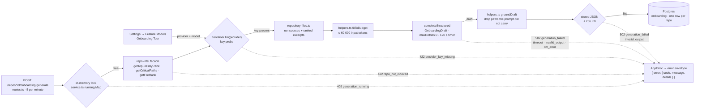

# `onboarding` — a five-part tour of a repo, written by one model call

`onboarding` produces the **Onboarding Tour** (`/repos/:repoId/tour` in the
client): architecture prose with an optional Mermaid diagram, critical-path files,
the commands to run the project locally, a reading path, and up to five starter
tasks. One tour is stored per repo and replaced on **Regenerate**.

The split that shapes the module: **code picks the files, the model writes the
words.** The list of files comes from the `repoIntel.*` facade (rank order, ties
by path). The model returns prose, one-line reasons, commands and tasks, and
`groundDraft` then drops every path the prompt did not carry before anything is
stored (`helpers.ts:221`). Reading this is a *reference + explanation* document:
the routes and failure codes, then why each step is shaped the way it is.

The module is a default Fastify plugin registered in `modules/index.ts:16,46`.
`routes.ts` builds `OnboardingService` and hands it lazy ports
(`container.repoIntel.*`, `container.llm(provider)`, `container.tokenizer`) —
read per call, so a test that patches the facade after `buildApp()` is honoured
(`routes.ts:35`).

## Generate flow

- **The lock is taken before any work and released in a `finally`**, so every
  failure below it frees the repo again (`service.ts:117-124`). The order is
  `404` for an unknown repo, then the `409` check and the lock, then
  `repo_not_cloned` (`service.ts:111-133`) — so even a not-cloned repo holds the
  mark for the instant it takes to fail.
- **The index decides the files, not the model.** `getTopFilesByRank(repoId, 8)`
  is the reading path; `getCriticalPaths` chains are flattened and
  `selectCriticalFiles` keeps the 6 highest-ranked distinct files, equal ranks by
  path (`service.ts:137-157`, `helpers.ts:38`). Ranks come from `getFileRank`,
  which returns `rank` for exactly this sort — see
  [`../repo-intel/README.md`](../repo-intel/README.md#determinism-and-junk-paths).
- **The key is probed before any file is read or token spent** (`service.ts:159-174`).
  `ConfigError` from `container.llm` becomes `provider_key_missing`; anything
  else rethrows.
- **Everything cloned is data.** Each run source, excerpt, the file list and the
  repo map are wrapped with `wrapUntrusted` (`helpers.ts:103-135`) and the system
  prompt tells the model to treat `<untrusted>` blocks as data
  (`constants.ts:119`).
- **Grounding runs against what the prompt actually carried.** The set G is the
  listed files plus every run source and excerpt that survived `fitToBudget`
  (`helpers.ts:175`), so a command citing a file that was trimmed away for the
  token budget is dropped.
- **The dotted edges are failure paths.** Each one throws an `AppError`; the
  error handler (`app.ts:116`) turns it into the envelope.

## Routes and error codes

| Route | Success | Notes |
|---|---|---|
| `GET /repos/:id/onboarding` | `200 OnboardingPage` | The stored tour (or `tour: null`), `generating`, `stale`. Makes **no LLM call** and works with `REPO_INTEL_ENABLED=false` (`service.ts:93`). |
| `POST /repos/:id/onboarding/generate` | `200 OnboardingPage` | Synchronous; body must be `{}` (`.strict()`). Rate limit 5 per minute (`constants.ts:30`). |

Errors, all in the `{ error: { code, message, details } }` envelope:

| Status | `code` | `details` | Raised when |
|---|---|---|---|
| 404 | `not_found` | — | Unknown repo, or one in another workspace (both routes) |
| 409 | `generation_running` | — | A generation for this repo is already marked running |
| 422 | `repo_not_cloned` | — | The repo has no `clonePath` |
| 422 | `repo_not_indexed` | `reason`: `flag_off` · `never_indexed` · `index_failed` · `no_ranked_files` | No ranked files to build from; the reason comes from the flag plus the index state, never from an empty array alone (`helpers.ts:55`) |
| 422 | `provider_key_missing` | `provider` | No API key for the provider picked in Settings |
| 422 | `validation_error` | zod issues | Body is not `{}` |
| 502 | `generation_failed` | `reason`: `timeout` · `invalid_output` · `llm_error` | See below |

`generation_failed` reasons (`service.ts:266-269`, `service.ts:235-240`):

- `timeout` — the service's own 120 s timer fired.
- `invalid_output` — the provider answered and the answer did not match
  `OnboardingDraft` (a `StructuredOutputError`, or a `ZodError` by name), **or**
  the grounded tour serialised to more than 256 KB.
- `llm_error` — any other failure from the provider call.

Nothing is stored on any `502`. The failure is logged with the same fields as a
success (`provider`, `model`, `durationMs`, tokens and cost as `null`,
`outcome`) at `warn` (`service.ts:194-198`).

## The generation lock

`OnboardingService` keeps `running: Map<repoId, startedAtMs>` in process memory
(`service.ts:82`). A second `POST` while the mark is fresh gets `409
generation_running`, and `GET` reports `generating: true` so the page can poll.

- **It is not a distributed lock.** It covers one API process; a restart clears
  it, and two API instances would not see each other.
- **A mark stops blocking after 10 minutes** (`GENERATION_STALE_MS`,
  `constants.ts:27`; the check is `service.ts:88`). The `finally` only deletes its
  own mark, so a newer generation that replaced a stale one is not unlocked by the
  older call finishing (`service.ts:123`).
- **The timer does not cancel the call.** `callModel` races the provider call
  against a timer with `Promise.race`; no abort signal is passed
  (`service.ts:253-264`). After a `timeout` the lock is released while the
  provider request may still be in flight, and its result is discarded.

## The one model call

`completeStructured` is called once with `schema: OnboardingDraft`,
`temperature: 0`, **`maxRetries: 0`** and **`timeoutMs: 120_000`**
(`service.ts:254-262`).

- **`maxRetries: 0` means no reprompt.** The OpenAI, Anthropic and OpenRouter
  `completeStructured` loops run `maxRetries + 1` attempts, each reprompting with
  the validation error (`adapters/llm/openai.ts:90-96`,
  `adapters/llm/anthropic.ts:92-99`, `reviewer-core/src/llm/openrouter.ts:61-68`).
  With `0` there is a single attempt, so a bad answer fails instead of costing a
  second call.
- **The 120 s timer is the service's, not the provider's.** `timeoutMs` is
  `GENERATION_TIMEOUT_MS` (`constants.ts:25`), and the `setTimeout` in
  `callModel` rejects with `GenerationTimeout` → `reason: timeout`
  (`service.ts:249-251`).
- **The model comes from Settings.** `resolveModel` is
  `resolveFeatureModel(container, workspaceId, 'onboarding')`
  (`routes.ts:45`): the workspace's `feature_models.onboarding` choice, else the
  registry default `openrouter` / `deepseek/deepseek-v4-flash`
  (`vendor/shared/contracts/platform.ts:44-49`). In the UI that is **Settings →
  Feature Models → "Onboarding Tour"**. The provider and model used are stored on
  the tour (`provider`, `model`).

## What the model is shown

| Input | Source | Cap |
|---|---|---|
| Files to explain | `getTopFilesByRank` (8) + critical files (6) | `MAX_READING_PATH`, `MAX_CRITICAL_PATHS` |
| Run sources | root files from `RUN_SOURCE_FILES` (README, `package.json`, Makefile, compose files, `.env.example`, …), root only, regular files only | 16 000 chars for a README, 8 000 for the rest |
| Excerpts | first 150 lines of each listed file, rank order | `EXCERPT_MAX_LINES` |
| Repo skeleton | `getRepoMap` | — |
| Whole input | system + user messages | `MAX_INPUT_TOKENS` = 60 000; `fitToBudget` drops excerpts from the lowest rank up, then run sources from the end of the list (`helpers.ts:146`) |

`repository-files.ts` is ring 3 (it reads the filesystem) and never throws:
anything unreadable, binary, outside the clone, absolute or containing `..` is
skipped, and a `.env*` file that is not `.env.example`, `.env.sample` or
`.env.template` is never opened (`helpers.ts:69`).

## What survives grounding

`groundDraft` (`helpers.ts:221`) rebuilds the sections from the index's lists and
only takes text from the draft:

| Section | Rule |
|---|---|
| `reading_path`, `critical_paths` | Membership and order are the index's. A model reason is matched by exact path, the first one per path wins, and one that names an unlisted path is dropped. A listed file with no reason keeps `reason: null`. Reasons are cut to one line of 200 chars. |
| `run_locally` | A command survives only if it is one line, ≤ 300 chars, and its `source_path` is in G. At most 10. |
| `first_tasks` | Paths are filtered to G; a task with none left, or empty text, is dropped. At most 5. |
| `architecture.diagram` | Kept when ≤ 4 000 chars, otherwise `null`. |
| `architecture.prose` | Trimmed and cut at 12 000 chars. |

The per-section removal counts are logged as `removed`. The caps are written in
two places — the contract's `.max()` (`vendor/shared/contracts/knowledge.ts:74-77`)
and `constants.ts` — and `onboarding-limits.test.ts` pins them to each other.

## Storage and staleness

- One row per repo in `onboarding` (PK `repo_id`, removed with the repo); a
  generation is an upsert (`repository.ts:48`). A stored row that no longer parses
  as `Onboarding` reads as `tour: null` (`repository.ts:37`).
- `stale` is true when the tour's `index_sha` differs from the repo's current
  `lastIndexedSha` and that is non-empty (`helpers.ts:297`). It is a hint on the
  page; nothing regenerates automatically.

## Known limitations

- **OpenRouter output that is not JSON is reported as `llm_error`, not
  `invalid_output`.** `parseWithRepair` fails on it inside reviewer-core before
  `safeParse` runs, so `SchemaFailureTagger` never sees a schema mismatch and the
  plain `Error` falls through (`reviewer-core/src/llm/structured.ts:62-72`,
  `adapters/llm/schema-failure.ts:19-21`). Closing it means tagging the error in
  `reviewer-core/src/llm/openrouter.ts`, which this change left alone. Output
  that is JSON but the wrong shape *is* `invalid_output`.
- **OpenRouter's own timeout and retries sit under the 120 s timer.** The
  `OpenRouterProvider` client is built with a 90 s per-request timeout and the
  SDK's default of 2 transport retries (`reviewer-core/src/llm/openrouter.ts:54-55`;
  the container passes neither option, `platform/container.ts:254-259`), and it
  does not read the per-request `timeoutMs` the service sends. `maxRetries: 0`
  stops reprompts only, not those transport retries. A slow or failing OpenRouter
  call can therefore be retried inside the 120 s window and end as `timeout`
  rather than as the error that caused the retries.
- **The lock is per process** — see [The generation lock](#the-generation-lock).

## Tests

| File | Covers |
|---|---|
| `test/onboarding-helpers.test.ts` | selection, prompt, budget, grounding, staleness (pure) |
| `test/onboarding-limits.test.ts` | caps pinned to the contract, 256 KB guard, grounding after the budget trim, typed schema failure |
| `test/onboarding-service.test.ts` | the service with fakes: one call with `maxRetries: 0`, the 409 lock and its 10-minute expiry, the 502 reasons, the log line |
| `test/onboarding-files.test.ts` | the clone reader: allowlist order, secret `.env`, symlinks, 150-line cut |
| `test/onboarding.it.test.ts`, `test/onboarding-scope.it.test.ts` | routes on real Postgres: the Settings model is recorded, Regenerate keeps one row, GET makes no model call, a foreign workspace gets 404, equal ranks come back by path |
| `test/repo-intel-top-files.test.ts`, `test/schema-failure.test.ts` | the junk filter and rank order; the schema-failure tagger |
