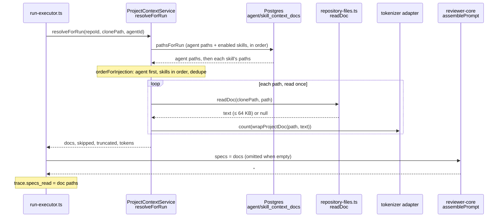

# `project-context` — clone Markdown attached to agents and skills

`project-context` lets a user pick Markdown files from a repo's local clone
(specs, docs, `INSIGHTS.md`, anything `.md`) and attach them, in order, to an
**agent** or to a **skill**. When that agent runs a review, the attached
documents are read from the clone and injected into the prompt as untrusted,
path-labelled data. No route in this module calls a model
(`routes.ts:96`).

The module is a port plus an adapter-shaped reader: `run-executor.ts` reaches it
only through `Container['projectContext']` (`platform/container.ts:170`), a
type-only edge — the same shape as `intent` — because `no-cross-module-reach-in`
forbids importing `modules/project-context/*` directly.

## A run, end to end

- `resolveForRun` never throws for a missing clone or file: no `clonePath` returns
  an empty result (`service.ts:294`); an unreadable path lands in `skipped`
  (`service.ts:302`). `run-executor.ts` additionally swallows a rejected call
  (`run-executor.ts:422`), so Project Context can never fail a run.
- It is resolved **once per agent run**, and the result is reused across
  map-reduce chunks (`run-executor.ts:413`).
- With no documents the `specs` input is left out and the prompt is unchanged
  (`run-executor.ts:246`).

## Routes

All ten go through `getContext` for the workspace and declare Zod
`params`/`querystring`/`body`/`response`, so invalid input is a 422 before the
handler (`routes.ts`). The four writes are described under
[Authoring under `.devdigest/specs/`](#authoring-under-devdigestspecs).

| Route | Query / body | Returns | Notes |
|---|---|---|---|
| `GET /repos/:id/context` | — | `ContextFileList` `{ cloned, total, files[] }` | `files` is capped at 500, sorted by path, no `content`; `total` is the uncapped count. Each file carries `kind`, `size`, `updated_at`, `tokens`, `used_by`. Not cloned → `{ cloned: false, total: 0, files: [] }`. |
| `GET /repos/:id/context/file` | `?path=` | `SpecFile` with `content` | The path must be in the listing, else 422 (`service.ts:224`); unreadable → 404. |
| `POST /repos/:id/context/files` | body `{ kind: 'file' | 'folder', name }` | 201 `SpecFile` | Creates `.devdigest/specs/<name>` or `<name>/spec.md`; a taken name gets `-2`, `-3`. |
| `POST /repos/:id/context/upload` | body `{ name, content_base64 }` | 201 `SpecFile` | Writes the decoded bytes unchanged, in the root only. |
| `PUT /repos/:id/context/file` | body `{ path, content, version | null }` | `SpecFile` | Save. `version: null` means "expect the file to be absent". |
| `DELETE /repos/:id/context/file` | `?path=&version=` | 204 | Removes the file and any folder left empty. |
| `GET /agents/:id/context` | `?repoId=` (uuid) | `ContextAttachments` `{ repo_id, paths }` | Paths in attach order. |
| `PUT /agents/:id/context` | `?repoId=`, body `{ paths }` | `ContextAttachments` | Replaces the whole ordered list. |
| `GET /skills/:id/context` | `?repoId=` | `ContextAttachments` | |
| `PUT /skills/:id/context` | `?repoId=`, body `{ paths }` | `ContextAttachments` | |

Contracts live in `@devdigest/shared` (`vendor/shared/contracts/platform.ts:254`):

- A `ContextPath` is 1–1024 characters and must end in `.md`. The `PUT` body is
  `{ paths }` with at most 500 entries, strict, and the paths must be unique.
- An unknown repo, agent or skill is 404, scoped to the caller's workspace
  (`repository.ts` `getRepo` / `agentExists` / `skillExists`).
- A `PUT` validates against the current listing **only the paths that are not
  already persisted** (`service.ts:251`). A previously attached file that has
  since vanished from the clone stays attachable and is reported as skipped at
  run time, rather than blocking every later edit. A new path outside the
  listing is a 422 naming the offenders.
- `tokens` on a listing row is the size of the block **as injected**, that is of
  `wrapProjectDoc(path, text)`, not of the raw file (`service.ts:213`); it is
  `null` when the file cannot be read. `used_by` counts distinct agents, through
  a direct attachment or through an enabled skill link (`repository.ts` `usedByPairs`,
  `helpers.ts` `countUsedBy`).

## Authoring under `.devdigest/specs/`

The Project Context page can create, upload, edit and delete Markdown under
`<clone>/.devdigest/specs/`. These files exist **only in the local clone's working
tree**: nothing is stored in Postgres, committed or pushed, and they never enter a
PR diff (diffs are commit to commit) or the repo-intel index. A run reads them
through the same `readDoc` as any other clone Markdown, so the next run injects the
saved text, or skips a deleted file; a run already in progress keeps what it read.

**Version token.** `SpecFile.version` is the SHA-256 hex of the file's **full** bytes
on disk (`readDoc` hashes before truncation). Save and delete send the version they
loaded; a mismatch is **409** with `error.code === 'version_conflict'` and
`error.details = { reason: 'changed' | 'deleted', current_version }`
(`current_version` is `null` after a delete). Overwrite is a client-side retry with
`current_version`; `null` recreates a deleted file. A clone-less repo gets **409**
`repo_not_cloned` on every write, and nothing is touched.

| Guard | Rule | Where |
|---|---|---|
| Root | A write path must start with exactly `.devdigest/specs/` (anchored, case-sensitive) and end in `.md`; absolute, `..` and empty segments are 422 naming `path` | `helpers.ts` `isUnderSpecsRoot`, `specsPathRule` |
| Names | 1–255 UTF-8 bytes; no `< > : " /  | ? *` or U+0000–U+001F; no trailing dot or space; no reserved device name (`CON`, `PRN`, `AUX`, `NUL`, `COM1`–`COM9`, `LPT1`–`LPT9`, compared on the part before the first `.`); a file name ends in `.md` | `helpers.ts` `entryNameRule` |
| Layout | `.devdigest`, `.devdigest/specs` and every folder below must be real directories (`lstat`, no symlink or junction); the clone root itself may be reached through a junction (both sides are `realpath`ed once) | `repository-writes.ts` `checkLayout` |
| Tracked | A file tracked at `HEAD` (`GitClient.listTracked`, `git ls-tree`) is read-only. **Fails closed**: if git throws, every root file is treated as tracked and creates are refused | `service.ts` |
| Size / encoding | At most **65,536** bytes, valid UTF-8, no NUL. Save is measured **after** CRLF→LF and written with LF; an upload is written unchanged | `helpers.ts` `contentRule`, `uploadBytesRule` |
| Atomic write | Temp file `.<base>.<random>.tmp` then `rename`; creates use `wx`/non-recursive `mkdir` so a name is never overwritten | `repository-writes.ts` |
| Lock | One in-process lock per repo serialises writes; two simultaneous creates yield two distinct files | `service.ts` |
| Pruning | Delete `rmdir`s every now-empty parent, never `.devdigest/specs` itself | `repository-writes.ts` `removeAndPrune` |

A listing row also carries `version`, `editable` and `read_only_reason`
(`outside_root` > `tracked` > `too_large`). A rule failure is 422 with
`details = { field, rule }`.

**Root exception to the listing check.** `GET /repos/:id/context/file` and the attach
`PUT`s accept a path under `.devdigest/specs/` that exists on disk even when it is
not among the 500 listed rows; every other path must still be in the current listing.
The picker has no matching exception: an attached root file past the cap shows as
"missing" there and is left out of its token total, yet a run injects it. It is rare
because `.devdigest/` sorts near the top.

**Write log.** Each write request logs exactly one
`project-context write` line with `repoId`, `path`, `bytes` and `outcome`
(`created`, `uploaded`, `saved`, `deleted`, `conflict` for a version conflict, otherwise
`rejected`); the content is never logged.

**Known limitation.** If the upstream repository later commits a file at an authored
path, the next resync (`reset --hard`) replaces the local copy. This is not detected;
the page says so in a note.

## Data model

Migration `0016_lethal_hellion.sql`, schema in `src/db/schema/project-context.ts`.
Both tables are binding tables like `agent_skills`: no `workspace_id`; tenancy is
checked in the service against the owner and the repo.

| Table | Columns | Keys |
|---|---|---|
| `agent_context_docs` | `agent_id`, `repo_id`, `path`, `order`, `created_at` | PK `(agent_id, repo_id, path)`; FK to `agents` and `repos`, both `ON DELETE cascade`; index on `repo_id` |
| `skill_context_docs` | `skill_id`, `repo_id`, `path`, `order`, `created_at` | PK `(skill_id, repo_id, path)`; FK to `skills` and `repos`, both cascade; index on `repo_id` |

- Attachments are **per repo**: the same agent has a separate list for each
  repo, and deleting a repo, agent or skill removes its rows.
- A `PUT` is delete-then-insert in one transaction, with the owner row locked
  `FOR UPDATE` so two concurrent `PUT`s serialise (`repository.ts:206`).
  `order` is the array index.

## The clone reader

`repository-files.ts` is ring 3 (the filesystem); `helpers.ts` is pure and does no
I/O. Limits are in `constants.ts`.

| Guard | Rule | Where |
|---|---|---|
| Listing | Walks the clone for `*.md` (case-insensitive), skipping `.git` and `node_modules`; symlinked entries are skipped, never followed | `repository-files.ts:83` |
| File cap | At most **500** files listed (sorted by path); `total` reports the full count | `constants.ts:3`, `repository-files.ts:112` |
| Traversal | Absolute-looking paths (`/…`, `\\…`, `C:\…`), `..` segments and empty segments return `null` | `repository-files.ts:127` |
| Containment | The resolved path must stay under the clone root, then the **`realpath`** of both must too, so a symlink pointing outside is rejected | `repository-files.ts:134` |
| Type | Must be a regular file; a NUL byte in the first 1 KB (binary) returns `null` | `repository-files.ts:141` |
| Size cap | **64 KB** per document; longer text is cut, a trailing split multi-byte character is trimmed, and `\n\n… [truncated at 64 KB]` is appended | `constants.ts:4`, `repository-files.ts:145` |
| Failure | `readDoc` never throws; every failure is `null` | `repository-files.ts:150` |

`kindForPath` derives a document's `kind` from its path alone, first match wins
(`helpers.ts:4`):

1. any directory segment named `specs` → `specs`
2. any directory segment named `docs` → `docs`
3. basename `INSIGHTS.md`, or a directory segment named `insights` → `insights`
4. otherwise `other`

## How a run resolves documents

1. `pathsForRun` returns the agent's own paths, then the paths of each skill linked
   to the agent, in `agent_skills.order`. A skill counts only when both
   `skills.enabled` and `agent_skills.enabled` are true (`repository.ts:234`).
2. `orderForInjection` concatenates the lists, agent first, and keeps the first
   occurrence of a path (`helpers.ts:15`). A document attached to both an agent
   and a skill is read and injected once.
3. Each path is read once with `readDoc`; the result feeds `docs`, `skipped`
   (null read) and `truncated` (cut at 64 KB).
4. `run-executor.ts` passes the docs as `specs` (`run-executor.ts:246`).
   `assemblePrompt` wraps each with `wrapProjectDoc(path, content)`, which emits
   `<untrusted source="doc:<path>">…</untrusted>`; `"`, `<`, `>` and newlines in
   the path are replaced with `_` so a file name cannot close the tag
   (`reviewer-core/src/prompt.ts:47`). The section is `## Project context`
   (`prompt.ts:147`).
5. The run log records one line per skipped and truncated path and a summary with
   the document count and tokens (`run-executor.ts:426`). The run trace's
   `specs_read` lists the injected paths (`run-executor.ts:348`), and
   `prompt_assembly.specs` holds the rendered slot.

The documents are **untrusted**: the shared `INJECTION_GUARD` tells the model that
everything inside `<untrusted>` blocks is data to analyse, never instructions
(`reviewer-core/src/prompt.ts:16`).

## Token counting

`countTokens` is injected as `(s) => this.tokenizer.count(s)`
(`platform/container.ts:176`), the shared tokenizer adapter
(`adapters/tokenizer/index.ts`). Both the listing and the run count the
**wrapped** block, so the picker's estimate and the run log use one rule.

`TiktokenTokenizer.count` encodes whole text normally. js-tiktoken's BPE merge is
super-linear on a single whitespace-free piece (a base64 blob, a minified line),
so when the text contains a run of 512 or more non-whitespace characters
(`/\S{512,}/`), it is encoded in 64-character slices and the counts are summed
(`adapters/tokenizer/index.ts:26`). The count differs slightly at slice seams.
Ordinary prose never hits the slicing path. If the encoder fails to load once, the
adapter falls back to `ceil(chars / 4)` for the rest of the process.

## Files

| File | Role |
|---|---|
| `routes.ts` | the ten routes and the write log hook |
| `service.ts` | `ProjectContextService` — listing, validation, writes, `resolveForRun` |
| `types.ts` | `ProjectContextPort` (what the container exposes), `ProjectContextStore`, `ProjectContextDeps` |
| `repository.ts` | Drizzle persistence, workspace-scoped lookups, `usedByPairs` |
| `repository-files.ts` | the clone reader and its guards; `readDoc` also returns the version |
| `repository-writes.ts` | ring-3 writer: layout check, exclusive create, atomic replace, remove and prune |
| `helpers.ts` | `kindForPath`, `orderForInjection`, `countUsedBy`, `newPaths`, and the pure write rules (root predicate, name and content rules, `nextFreeName`, `readOnlyReason`) |
| `constants.ts` | `MAX_CONTEXT_FILES`, `MAX_DOC_BYTES`, excluded dirs, truncation marker, `SPECS_ROOT`, name limit and file templates |

The client side — the Project Context page and the Context tabs — is described in
`client/README.md`.
