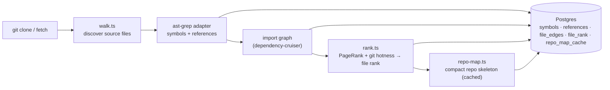

# `repo-intel` — the codebase indexer

`repo-intel` reads a cloned repository **once on clone** (and incrementally on
fetch, keyed by file content hash) and turns it into queryable facts: symbols,
the import graph, a PageRank-based file importance score, and a compact **repo
map** (the project skeleton). On a review it is only **read** — the index is
already computed, so adding context to a prompt costs no analysis at request time.

This is **starter infrastructure**: it works from day 1 (the **Indexed** badge),
but you don't write it. Course lessons build features _on top_ of its facade —
Blast Radius (L04), Conventions samples (L02), Onboarding reading-path (L05),
the Phantom-API gate (L06) — by calling `repoIntel.*`, not by re-indexing.

## Pipeline

Full vs incremental indexing lives in `pipeline/{full,incremental}.ts`; an
unindexed or partially-indexed repo degrades gracefully (the facade returns empty
results rather than throwing).

## Facade (`repoIntel.*`)

Everything downstream reads through one facade (`service.ts`) so consumers never
touch the pipeline internals:

- `getRepoMap(repoId)` → the cached repo skeleton (fed into the **review prompt**).
- `getFileRank(repoId, files)` → `{ path, percentile, rank }` per file that has a
  `file_rank` row (`types.ts:119`, `repository.ts:440`). `percentile` drives the
  "top-N%" hint in a review; `rank` is the raw score (`file_rank.rank`, a double)
  that callers sort by.
- `getCallerSignatures(repoId, files, limit)` → callers of changed symbols.
- `getBlastRadius(repoId, files)` → impacted symbols / callers (used by L04).
- `getUnresolvedReferences(repoId, …)` → phantom-symbol detection (used by L06).
- `getConventionSamples(repoId, n)` → top-ranked files for convention extraction
  (L02); it is `getTopFilesByRank(repoId, n)` with no extra exclusions.
- `getTopFilesByRank(repoId, n, { exclude? })` → the top `n` paths by rank, minus
  junk paths (see below) and any path containing an `exclude` substring. It reads
  `max(n × 10, 100)` ranked rows first so the filter can still yield `n`.
- `getCriticalPaths(repoId)` → dependency chains: each of the 5 highest-ranked
  files seeds a chain that follows the highest-ranked import target for up to 2
  more hops (`CRITICAL_PATH_ROOTS`, `BFS_DEPTH`); a chain with fewer than 2 files
  or a repeat of an earlier chain is dropped.

Consumers today: `modules/reviews/run-executor.ts` (`getRepoMap`, `getFileRank`,
`getCallerSignatures`), `modules/blast/` (`getBlastRadius`),
`modules/conventions/` (`getConventionSamples`) and `modules/onboarding/`
(`getTopFilesByRank`, `getCriticalPaths`, `getFileRank`, `getRepoMap` — see
[`../onboarding/README.md`](../onboarding/README.md)). Toggled by
`REPO_INTEL_ENABLED` (global; with it off the rank reads return `[]`) and, for
reviews, a per-agent `repo_intel` flag.

### Determinism and junk paths

The onboarding tour stores whatever order these methods return, so equal ranks
must not fall back to database row order:

- **Ranked paths break ties by path.** `getRankedPaths` orders by `rank DESC`,
  then `file_path ASC` (`repository.ts:464`), so the `LIMIT` cut-off is stable.
- **Critical-path hops break ties by path.** The next hop is the unvisited
  import target with the highest rank, equal ranks by `localeCompare` on the
  path (`service.ts:689`).
- **`isJunkPath` matches against `'/' + path`** (`service.ts:730`), so the
  directory patterns `/test/`, `/tests/`, `/migrations/` and `/__fixtures__/`
  also exclude a **root-level** `test/x.ts`, `tests/x.ts`, `migrations/x.sql` or
  `__fixtures__/x.ts`; previously only a nested `src/test/…` matched. The other
  patterns (`.test.`, `.spec.`, `.d.ts`, `__tests__/`, `__mocks__/`, `.config.`,
  `vitest.`, `jest.`, `eslint`, `prettier`) are plain substring matches and are
  unchanged, so a name that merely contains one of them is dropped too
  (`service.ts:708`).

## Routes

- `GET /repos/:id/index-state` — index status (drives the **Indexed** badge).
- `POST /repos/:id/resync` — enqueue a re-index.

`getBlastRadius` is consumed by `modules/blast/` (`GET /pulls/:id/blast-radius`).
