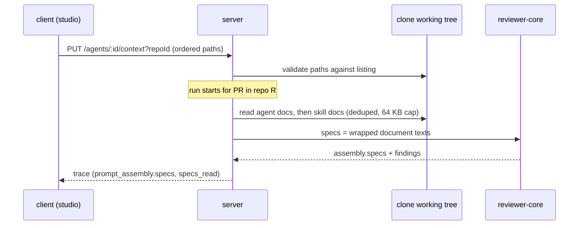

# Spec: Project Context — attach repo Markdown documents to agents and skills
Spec ID: SPEC-2026-09-29-project-context
Status: approved
Supersedes: none
Packages: server, client, reviewer-core

## Problem and user
A reviewer who configures agents in the studio cannot give an agent the project's own
specifications, design notes or recorded lessons. Today the only project knowledge a
review sees is the diff, the PR body, derived intent and the repo-intel skeleton, so
an agent flags things the project's specs explicitly allow and misses rules the specs
state. The workaround is to paste spec text into a skill body by hand. That copy goes
stale as soon as the file in the repo changes, and nothing shows how many tokens it adds
to every run.
**Request vs tree:** the brief's premise that nothing exists is only partly true. The
engine already has a `## Project context` prompt slot that wraps each entry as untrusted
(`reviewer-core/src/prompt.ts:47`, `:104-106`, `:127`), and the run trace already has
`prompt_assembly.specs` and `specs_read` fields (`server/src/vendor/shared/contracts/trace.ts:44`, `:109`),
but the server never fills them: it passes no `specs` and writes `specs_read: []`
(`server/src/modules/reviews/run-executor.ts:231-260`, `:342`). The run drawer already
shows the slot, labelled "Project context (dynamic)" (`client/messages/en/runs.json:50`,
`client/src/app/repos/[repoId]/pulls/[number]/_components/RunTraceDrawer/_components/TraceBody/TraceBody.tsx:90-92`).
A `SpecFile` contract and a list hook for `/repos/:id/context` exist, but no route serves
it (`server/src/vendor/shared/contracts/platform.ts:254-261`, `client/src/lib/hooks/core.ts:122-137`,
`server/src/modules/repos/routes.ts:26-43`). No attachment storage exists; `agent_skills`
is the only binding table (`server/src/db/schema/agents.ts:65`).

## Goals / Non-goals
**Goals**
- The user browses and previews every Markdown document in the active repo's clone.
- The user attaches documents, in an order, to an agent or a skill for that repo, and
  sees the token cost before running.
- A run injects the full text of the attached documents as untrusted context. The run
  trace shows exactly that text and the list of paths that were read.

**Non-goals**
- Editing, creating, uploading or moving files in the clone (design 04 Edit mode, the
  new, folder and upload icons). See Q-1 and Q-2.
- The coverage ring and "Used by" semantics beyond a count of agents (Q-3).
- Chunking or embedding documents (`code_chunks.source = 'spec'`), the "chunks" footer,
  and the Intent layer's `getSpecChunks` source, which stays `unavailable` (Q-4).
- The "Skills loaded" chips in the trace Configuration block (Q-5).
- Reading the PR head's version of a document. The clone's working copy is used (answer 3).
- The CI runner and MCP tools; attachments apply to studio runs only (Q-9).
- Memory, Eval Dashboard, Multi-Agent Review, CI Runs and Onboarding Tour, which appear
  in the designs' chrome.

## User stories
- **US-1** As a reviewer, I want to list and preview the Markdown documents of the active
  repo, so that I know what project context exists.
- **US-2** As a reviewer, I want to attach and order documents on an agent and see the
  token estimate, so that I control what the agent reads and what it costs.
- **US-3** As a reviewer, I want to attach documents to a skill, so that every agent using
  the skill inherits them.
- **US-4** As a reviewer, I want a run to read the attached documents from the project and
  add their text to the prompt, so that findings are judged against the project's own specs.
- **US-5** As a reviewer, I want to open a run's Prompt assembly and read the full injected
  text, so that I can see exactly what the model was given.

## Acceptance criteria (EARS)
- **AC-1** WHEN the user opens the Project Context page with an active repo, the page shall list every `.md` file in that repo's clone working tree, excluding `.git/` and `node_modules/`, as repo-relative paths sorted by path. · traces: US-1 · verify: integration
- **AC-2** The system shall give each listed document one kind from its path: under a `specs/` folder → `specs`; under `docs/` → `docs`; named `INSIGHTS.md` or under `insights/` → `insights`; otherwise `other`. · traces: US-1 · verify: unit
- **AC-3** WHEN the user selects a document on the Project Context page, the page shall show its content rendered as Markdown, with its path as the heading. · traces: US-1 · verify: component
- **AC-4** The sidebar shall show a "Project Context" entry in the WORKSPACE group that opens the Project Context page for the active repo. · traces: US-1 · verify: e2e
- **AC-5** WHEN a document is selected, the Project Context page shall show "Used by N agents". N is the number of agents that receive that document for this repo, directly or through an enabled skill link. · traces: US-1 · verify: integration
- **AC-6** The Agent editor's Context tab shall list the active repo's documents. Each row shall show a checkbox, the path, a kind badge and a Preview action that shows the rendered document. The tab shall also show a filter box and an "N of M attached" count. · traces: US-2 · verify: component
- **AC-7** WHEN the user checks or unchecks a document on an agent's Context tab, the system shall persist or remove the (repo, path) attachment for that agent. The "N of M attached" count shall reflect the change without a page reload. · traces: US-2 · verify: integration
- **AC-8** WHEN the user reorders attached documents on an agent's Context tab, the system shall persist the new order and reproduce it on the next load. · traces: US-2 · verify: integration
- **AC-9** WHILE at least one document is attached, the Context tab shall show "≈ N tokens". N is the sum of the attached documents' token counts as they would be injected, including the per-document cap, and it shall update on every check, uncheck or reorder without a network round trip. · traces: US-2 · verify: component
- **AC-10** The Skill editor's Context tab shall offer the same list, toggle and filter as AC-6 and AC-7 for the skill. It shall show "Any agent using this skill inherits these documents." and a SERIALIZES AS box that lists the attached paths in order. · traces: US-3 · verify: component
- **AC-11** WHEN a run starts for an agent on a PR in repo R, the system shall read from R's clone working copy, in this order: the documents attached to the agent for R, then the documents attached for R to each skill that is enabled and enabled on that agent, in the agent's skill order. It shall inject each distinct path once, at its first position. · traces: US-4 · verify: integration
- **AC-12** The system shall inject each read document's full text, up to the per-document cap, as its own untrusted block under `## Project context`. Each block shall name the document's repo-relative path. · traces: US-4 · verify: unit
- **AC-13** WHEN a run that injected documents completes, the run trace's "Specs read" row shall list the injected paths in injection order. · traces: US-5 · verify: integration
- **AC-14** The Prompt assembly list shall label the slot "Project context — attached specs (untrusted)". Expanding it or opening it fullscreen shall show the complete injected text, and copying it shall put that same text on the clipboard. · traces: US-5 · verify: component
- **AC-15** IF no document reaches a run, directly or through a skill, THEN the system shall send a prompt byte-identical to today's and omit the Project context row from Prompt assembly. · traces: US-4 · verify: unit
- **AC-16** WHEN the user activates refresh on the Project Context page, the page shall re-read the clone listing and show added or removed files. · traces: US-1 · verify: component

## Edge cases
- **EC-1** IF the active repo has no clone yet, THEN the Project Context page and both Context tabs shall show an empty state saying the repo is not cloned, and attaching shall be unavailable. · traces: DR-7 · verify: component
- **EC-2** IF the clone contains no `.md` file, THEN the Project Context page and both Context tabs shall show an empty state that names the supported file type. · traces: DR-8 · verify: component
- **EC-3** IF the clone contains more than 500 `.md` files, THEN the system shall list the first 500 by path and the page shall say "showing 500 of N". · traces: DR-9 · verify: integration
- **EC-4** IF an attached document is missing or unreadable when a run starts, THEN the system shall skip it, name its path in the run log, leave it out of "Specs read" and complete the run. · traces: DR-10 · verify: integration
- **EC-5** IF a document exceeds 64 KB, THEN the system shall inject its first 64 KB followed by a visible truncation marker, and log the truncation in the run log. · traces: DR-11 · verify: integration
- **EC-6** IF a run's PR belongs to a repo other than an attachment's repo, THEN the system shall not inject that attachment. · traces: US-4 · verify: integration
- **EC-7** IF an attached path is no longer in the clone listing, THEN the Context tab shall show it as a "missing" row that can still be unchecked, and exclude it from the token estimate. · traces: DR-10 · verify: component
- **EC-8** IF an attach request names a path that is not in the repo's current listing, THEN the system shall reject it with 422 and persist nothing. This covers a path that escapes the clone, a non-`.md` file and a symlink target outside the clone. · traces: DR-1 · verify: integration
- **EC-9** IF the same path is attached to the agent and to one of its skills, THEN the run shall inject it once, at the agent's position. · traces: US-3 · verify: integration
- **EC-10** IF the document list or a document preview fails to load, THEN the surface shall show an error state with a retry action. · traces: DR-12 · verify: component
- **EC-11** IF the filter text matches no document, THEN the Context tab shall show a "no documents match" line and keep the attached count unchanged. · traces: DR-13 · verify: component
- **EC-12** WHEN the user toggles the same checkbox twice in quick succession, the persisted state shall equal the last visible state, with no duplicate attachment. · traces: DR-14 · verify: integration

## Design review
**Source:** specs/designs/project-context/01-agent-run-trace-prompt-assembly.png, 02-skill-editor-context-tab.png, 03-agent-editor-context-tab.png, 04-project-context-page.png. The designs show only the populated state of each screen; the other states were checked against the tree.
### Gaps
- **DR-1** Listing and reading clone Markdown files: no route serves `/repos/:id/context` (checked `server/src/modules/repos/routes.ts:26-43`), although the client hook calls it (`client/src/lib/hooks/core.ts:122-128`).
- **DR-2** Attachment storage per (agent or skill, repo, path, order): none. The only binding is `agent_skills` (`server/src/db/schema/agents.ts:65-85`).
- **DR-3** Run-time injection: the executor passes no `specs` and writes `specs_read: []` (`server/src/modules/reviews/run-executor.ts:231-260`, `:342`).
- **DR-4** Context tabs: the Agent editor has Config and Skills only (`client/src/app/agents/[id]/_components/AgentEditor/_components/`, tab labels `client/messages/en/agents.json:51-57`). The Skill editor has Config, Preview, Versions and Stats (`client/src/app/skills/[id]/_components/SkillEditor/SkillEditor.tsx:1`).
- **DR-5** Sidebar entry: WORKSPACE holds only Pull Requests, and there is no Onboarding Tour to sit beside (`client/src/vendor/ui/nav.ts:21-36`).
- **DR-6** The trace label reads "Project context (dynamic)" (`client/messages/en/runs.json:50`), not the design's "Project context — attached specs (untrusted)".
### Uncovered cases
- **DR-7** No clone yet (`repos.clone_path` nullable, `server/src/db/schema/repos.ts:16`) → EC-1
- **DR-8** Clone with zero Markdown files → EC-2
- **DR-9** Many files (a docs-heavy monorepo) → EC-3
- **DR-10** An attached file deleted or renamed in the clone → EC-4, EC-7
- **DR-11** Oversized document → EC-5
- **DR-12** List or preview load error → EC-10
- **DR-13** Filter with no matches → EC-11
- **DR-14** Double toggle → EC-12
- **DR-15** Keyboard-only reordering: the design shows only drag handles → NFR-4
- **DR-16** Traces persisted before this feature, and runs with no documents → AC-15, NFR-7
### Module interactions
| From | To | Through | Contract |
|---|---|---|---|
| `client` Project Context page | `server` `modules/project-context` (new) | `GET /repos/:id/context` | `SpecFile` in server/src/vendor/shared/contracts/platform.ts · existing, extended with kind, size, token count, used-by count |
| `client` Project Context page, Preview actions | `server` `modules/project-context` | `GET /repos/:id/context/file?path=` | `SpecFile` with `content` · existing |
| `client` Agent editor Context tab | `server` `modules/project-context` | `GET`/`PUT /agents/:id/context?repoId=` | `ContextAttachments` (repo id, ordered paths) · new |
| `client` Skill editor Context tab | `server` `modules/project-context` | `GET`/`PUT /skills/:id/context?repoId=` | `ContextAttachments` · new |
| `server` `modules/reviews` run executor | `server` `modules/project-context` | DI container facade (the `container.intent` precedent) | none (in-process) |
| `server` `modules/reviews` | `reviewer-core` `reviewPullRequest` / `assemblePrompt` | `specs` prompt part | `PromptAssembly.specs` in server/src/vendor/shared/contracts/trace.ts · existing |
| `client` run drawer | `server` `modules/reviews` | existing trace read | `RunTrace.specs_read`, `prompt_assembly.specs` · existing |

### UX improvements
- **DR-17** *proposed*: the SERIALIZES AS box shows the heading actually injected (`## Project context`) instead of the design's `## Project specifications`, so the preview matches the prompt. Motivated by US-3 and AC-10. See Q-6.
- **DR-18** *proposed*: show each row's own token count next to its kind badge, so the user sees which document is expensive. Motivated by US-2 and AC-9. See Q-8.

## Non-functional requirements
- **NFR-1** Size: the list response carries at most 500 entries and no document content. Content is returned one document per request. Each document injected into a prompt is at most 64 KB. · verify: integration
- **NFR-2** Cost: listing, previewing, attaching and the token estimate make no LLM call, and a run makes no extra LLM call because of attachments. · verify: integration
- **NFR-3** i18n: every new user-facing string comes from `messages/en/<namespace>.json`, with no literals. · verify: static
- **NFR-4** Accessibility: each checkbox's accessible name contains the document path. Attached documents can be reordered with the keyboard alone. The kind is conveyed by badge text, not colour alone. · verify: component
- **NFR-5** Degraded mode: attaching and injection work when the repo is unindexed or repo-intel is off for the agent. Neither changes which documents are injected. · verify: integration
- **NFR-6** Security: every injected document is wrapped as untrusted data, a closing delimiter inside a document cannot end its block, and `INJECTION_GUARD` is unchanged. · verify: unit
- **NFR-7** Compatibility: traces persisted before this feature still render, and a changed contract is mirrored in the client's vendored copy. · verify: static
- **NFR-8** Observability: each run logs one line with the number of injected documents, their total tokens, and the paths that were skipped or truncated. · verify: integration
- **NFR-9** Concurrency: changing attachments while a run is in progress does not change that run's prompt. Documents are read once, at run start. · verify: integration

## Traceability
| Requirement | Traces to | Verify how |
|---|---|---|
| AC-1 | US-1, DR-1 | integration |
| AC-2 | US-1 | unit |
| AC-3 | US-1 | component |
| AC-4 | US-1, DR-5 | e2e |
| AC-5 | US-1 | integration |
| AC-6 | US-2, DR-4 | component |
| AC-7 | US-2, DR-2 | integration |
| AC-8 | US-2, DR-2 | integration |
| AC-9 | US-2 | component |
| AC-10 | US-3, DR-4 | component |
| AC-11 | US-4, DR-3 | integration |
| AC-12 | US-4 | unit |
| AC-13 | US-5, DR-3 | integration |
| AC-14 | US-5, DR-6 | component |
| AC-15 | US-4, DR-16 | unit |
| AC-16 | US-1 | component |
| EC-1 | DR-7 | component |
| EC-2 | DR-8 | component |
| EC-3 | DR-9 | integration |
| EC-4 | DR-10 | integration |
| EC-5 | DR-11 | integration |
| EC-6 | US-4 | integration |
| EC-7 | DR-10 | component |
| EC-8 | DR-1 | integration |
| EC-9 | US-3 | integration |
| EC-10 | DR-12 | component |
| EC-11 | DR-13 | component |
| EC-12 | DR-14 | integration |
| NFR-1 | US-1, US-4 | integration |
| NFR-2 | US-2 | integration |
| NFR-3 | US-1 | static |
| NFR-4 | US-2, DR-15 | component |
| NFR-5 | US-4 | integration |
| NFR-6 | US-4 | unit |
| NFR-7 | US-5, DR-16 | static |
| NFR-8 | US-4 | integration |
| NFR-9 | US-4 | integration |

## Inputs and provenance
| Source | Path or URL | What it settled |
|---|---|---|
| request | coordinator brief (user's Ukrainian brief, rendered) | Feature scope: browse, attach to agents and skills, in-place token count, run-time injection from the project, the "Project context — attached specs (untrusted)" trace section |
| answers | "1. Discovery: (C) every `.md` file in the clone's working tree, excluding `.git/` and `node_modules/`, capped at 500 files. Kind from the path …" | AC-1, AC-2, EC-3 |
| answers | "2. Binding: (A) an attachment is a (repo, path) pair, kept in the user's chosen order; a run on a PR in another repo ignores it." | AC-7, AC-8, EC-6 |
| answers | "3. Version: (A) the clone's working copy as it is when the run starts. A missing or unreadable file is skipped and named in the run log." | AC-11, EC-4, non-goal on the PR head |
| answers | "Your other stated defaults stand as well" (injection order, 64 KB cap, untrusted wrapper, `specs_read`, read-only page) | AC-11, AC-12, AC-13, EC-5, non-goals, Q-1 to Q-4 |
| design | specs/designs/project-context/01-agent-run-trace-prompt-assembly.png | Trace label, Specs read row, row copy and expand |
| design | specs/designs/project-context/02-skill-editor-context-tab.png | Skill Context tab, inherit note, SERIALIZES AS |
| design | specs/designs/project-context/03-agent-editor-context-tab.png | Ordered list, Preview, "N of M attached", token estimate, untrusted note |
| design | specs/designs/project-context/04-project-context-page.png | Page layout, Preview/Edit toggle, "Used by N agents", coverage ring, footer |
| repo | reviewer-core/src/prompt.ts:30-34, :104-106, :127 | Existing untrusted wrapper and `## Project context` slot |
| repo | server/src/modules/reviews/run-executor.ts:225, :342, :395-404 | Skill-block precedent; `specs_read` is always empty |
| repo | server/src/vendor/shared/contracts/trace.ts:40-56, :109 | `PromptAssembly.specs` and `specs_read` exist |
| repo | server/src/modules/skills/repository.ts:207-219 | Skill order and both enabled flags used for inheritance |
| repo | server/src/modules/intent/repository-plans.ts:33-55 | Existing clone-file reader that refuses traversal and symlink escapes |
| repo | client/messages/en/context.json:1-23 | A prepared `context` i18n namespace |
| repo | server/src/db/schema/context.ts:44 | `code_chunks.source='spec'`: chunking stays out of scope |
| insights | INSIGHTS.md:262-266 | Shared contracts are vendored twice; mirror them in the same change → NFR-7 |
| insights | INSIGHTS.md:301-312 | Untrusted-wrapped text cannot instruct; documents are data, not rules → NFR-6, Q-7 |
| insights | server/INSIGHTS.md:175-182 | A clone reader belongs in its own repository file; helpers stay pure → EC-8 |

## Untrusted inputs
| Input | Source | Validation | On invalid |
|---|---|---|---|
| Document content | file under `server/clones/<repo>/**` | Text that reaches a prompt: wrapped as untrusted, closing delimiter escaped, 64 KB cap | Truncate to 64 KB with a marker; an instruction inside it is data and is never followed |
| Document content in preview | same | Text that is rendered: only through the existing Markdown renderer, never raw HTML | Raw HTML is rendered as text |
| `path` query or body item | HTTP request | Shape and bounds: string of 1–1024 chars, repo-relative, `.md`; must be in the repo's current listing; symlink targets stay under the clone | 422 naming the field; nothing is read or persisted |
| Attach body | HTTP `PUT` | Shape and bounds: strict object; at most 500 unique paths; order is the array order | 422 naming the field |
| `repoId`, agent `:id`, skill `:id` | HTTP params and query | Identity: resolves to a row in the caller's workspace | 404, indistinguishable from "does not exist" |
| File and folder names | clone listing | Text that is rendered: plain text | Shown verbatim as text, never as markup |

## Open questions
- **Q-1 (non-blocking):** Should Edit mode on the Project Context page write to the clone? — the author decides; this draft is read-only (non-goal).
- **Q-2 (non-blocking):** New file, new folder and upload icons: same decision as Q-1 — the author decides; they are hidden in this draft.
- **Q-3 (non-blocking):** What does the coverage ring (78) measure? — the author decides; it is omitted in this draft.
- **Q-4 (non-blocking):** The footer "Indexed: 12 files · 1,240 chunks · last 5m ago" implies chunk indexing, which would also feed the Intent layer's spec source. — the author decides; this draft has no chunking, and the page may show the file count only.
- **Q-5 (non-blocking):** Add the "Skills loaded" chips to the trace Configuration block? — the author decides; they are out of scope in this draft.
- **Q-6 (non-blocking):** Adopt DR-17 (the SERIALIZES AS heading matches the injected `## Project context`)? — the author decides; this draft lists the attached paths and leaves the heading open.
- **Q-7 (non-blocking):** Documents are untrusted, so a "MUST" in a spec informs findings but cannot instruct the model (INSIGHTS.md:301-312). Is that the intended meaning? — the author decides; this draft keeps them untrusted, as the design's note says.
- **Q-8 (non-blocking):** Adopt DR-18 (a token count per row)? — the author decides; this draft shows the total only.
- **Q-9 (non-blocking):** Should the CI runner or the MCP tools see attachments? — the author decides; studio runs only in this draft.
- **Q-10 (non-blocking):** Sidebar position: the design places the entry after an "Onboarding Tour" item that does not exist in the nav. — the author decides; this draft places it after Pull Requests.
- **Q-11 (non-blocking):** Section order: the design lists Project context before Repo skeleton, but the prompt and the drawer render Repo skeleton first (`reviewer-core/src/prompt.ts:124-127`). — the author decides; this draft keeps today's order.
- **Q-12 (non-blocking):** In map-reduce mode the block is sent once per chunk (`server/src/modules/reviews/run-executor.ts:391-393`), so the "≈ N tokens" figure is per model call, not per run. Should the estimate say so? — the author decides; this draft shows the per-call figure.
