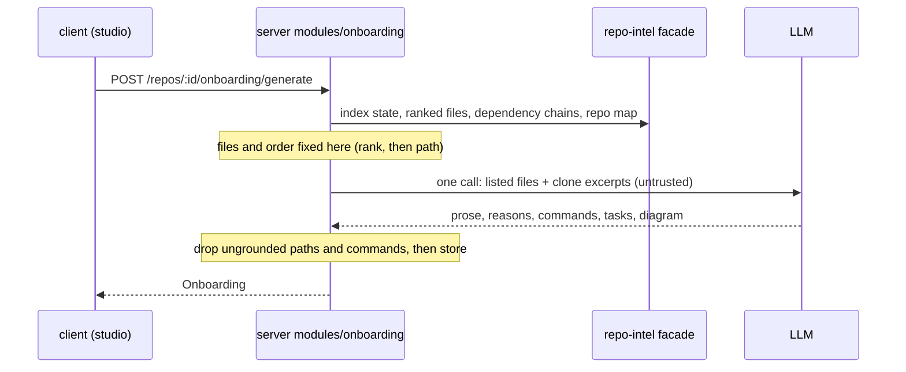

# Spec: Onboarding Generator — a five-part tour of an unfamiliar repository
Spec ID: SPEC-2026-10-01-onboarding-generator
Status: draft
Supersedes: none
Packages: server, client

## Problem and user
A developer who has just imported a repository into DevDigest has no starting point. They do
not know which files carry the architecture, which ones are risky to touch, how to start the
project, or what to read first. Today they open the clone, skim the README and grep around.
The repo-intel index already knows which files are central, but nothing presents that to a
person. The Onboarding Generator turns the index plus one narrative LLM call into a tour with
five parts: architecture overview, critical paths, how to run locally, a guided reading path,
and first tasks. The reading path is ordered by index rank, not by the model.
**Request vs tree:** the feature is scaffolded but not built. Already present: a one-row-per-repo
`onboarding` table (`server/src/db/schema/context.ts:120-126`, created in
`server/src/db/migrations/0000_init.sql:205`); a loose `Onboarding` contract of free-form
sections (`server/src/vendor/shared/contracts/knowledge.ts:28-47`, identical in the client copy);
an `onboarding` feature-model entry with a default model (`server/src/vendor/shared/contracts/platform.ts:15-21`,
`:45-51`, mirrored in `client/src/lib/feature-models.ts:14-20`); a system prompt
(`server/src/prompts/onboarding.system.md`); an i18n namespace (`client/messages/en/onboarding.json`)
and a nav label (`client/messages/en/shell.json:19`); and two repo-intel facade methods that
nothing calls yet, `getTopFilesByRank` and `getCriticalPaths` (`server/src/modules/repo-intel/types.ts:165-171`,
`server/src/modules/repo-intel/service.ts:639-702`). Missing: no server module or route
(`server/src/modules/index.ts:30-45`), no tour page, and no sidebar entry (`client/src/vendor/ui/nav.ts:21-28`).
`/onboarding` is the **Add repository** screen, not the tour (`client/src/app/onboarding/page.tsx:1-8`,
`e2e/README.md:105`). The scaffolded prompt and empty-state copy describe a different section set
from the designs (DR-4).

## Goals / Non-goals
**Goals**
- For the active repo, the user generates a tour with the five designed sections, reads it on
  one page, and regenerates it on demand.
- Which files appear in the reading path and critical paths, and in what order, comes from the
  index. The model only writes the prose around them.
- Every file path in the tour exists in the repo, and every run command comes from a file in
  the repo.

**Non-goals**
- Publishing the tour outside the studio, Markdown export, and writing it to the repo folder
  (`sync_to_folder`). Share link only copies the studio URL (Q-5, resolved).
- An in-app source viewer for "Open" (Q-6, resolved).
- An MCP tool for the tour (Q-14, resolved).
- Tours in languages other than English (Q-12, resolved).
- Regenerating a tour automatically, for example when it goes stale (Q-15, resolved).
- Changing repo-intel's ranking or indexing pipeline. The index is consumed as it is.
- The mockup host's chrome ("Content is user-generated and unverified", "Start chat", "Share"
  in the top bar) and the other sidebar items (Memory, Eval Dashboard, CI Runs, …).

## User stories
- **US-1** As a developer new to a repo, I want a five-part tour of the active repo on one page, so that I know where to start.
- **US-2** As a developer new to a repo, I want the files to read listed in order of importance, each with a one-line reason, so that I read the central code first.
- **US-3** As a developer new to a repo, I want copyable commands to run the project locally, so that I can start it without searching the docs.
- **US-4** As the person who imported the repo, I want to generate and regenerate the tour and see how fresh it is, so that it matches the current index.
- **US-5** As a developer reading the tour, I want to open a listed file and copy a link to the tour, so that I can move from the tour to the code and point a teammate to it.

## Acceptance criteria (EARS)
- **AC-1** The sidebar shall show an "Onboarding Tour" entry in the WORKSPACE group, between Pull Requests and Project Context, that opens the Onboarding Tour page for the active repo. · traces: US-1 · verify: e2e
- **AC-2** WHEN the user opens the Onboarding Tour page for a repo that has a stored tour, the page shall show the title "Onboarding for <repo name>", a subtitle with the number of files indexed when the tour was generated and the time since the tour was generated, and the five sections in this order, all expanded on every visit: Architecture overview, Critical paths, How to run locally, Guided reading path, First tasks. · traces: US-1, US-4 · verify: component
- **AC-3** WHEN the user activates a section header, the page shall expand or collapse that section and leave the other sections as they are. · traces: US-1 · verify: component
- **AC-4** WHEN the user activates an entry in the "On this page" list, the page shall expand that section and scroll it into view. · traces: US-1 · verify: component
- **AC-5** WHEN the user activates Generate or Regenerate, the system shall build the tour with exactly one LLM call to the model chosen for "Onboarding Tour" in Settings → Feature Models, replace the repo's stored tour with it, recording the provider and model that wrote it, and show it. · traces: US-4 · verify: integration
- **AC-6** The Guided reading path shall list at most 8 indexed source files, excluding tests, configs, declaration files and migrations, in descending index rank, with equal ranks ordered by path ascending. Each entry shall show its position number, its path and a one-line reason. · traces: US-2, DR-5 · verify: integration
- **AC-7** The system shall take which files appear in the Guided reading path and Critical paths, and their order, from the index alone. From the model output it shall use only the one-line reason for each listed file. · traces: US-2 · verify: unit
- **AC-8** The Critical paths section shall list at most 6 distinct files that lie on the index's dependency chains from the highest-ranked files, in descending rank. Each row shall show the path, a one-line reason and an Open action. · traces: US-1, DR-7 · verify: integration
- **AC-9** The Architecture overview shall show the model's prose rendered as Markdown and, when the model returned a diagram that parses, that diagram rendered as a graph below the prose. · traces: US-1 · verify: component
- **AC-10** The How to run locally section shall show at most 10 commands as a numbered list, each with a copy action. · traces: US-3 · verify: component
- **AC-11** WHEN the user activates a command's copy action, the system shall put exactly the displayed command line on the clipboard and show a confirmation. · traces: US-3 · verify: component
- **AC-12** The First tasks section shall show 1 to 5 starter tasks. Each task shall be one line with at least one link to a file in the repo. · traces: US-1, DR-6 · verify: component
- **AC-13** WHEN the user activates Open on a file row, the system shall open that file on GitHub, at the repo's default branch, in a new tab. · traces: US-5 · verify: component
- **AC-14** WHEN the user activates Share link, the system shall copy the Onboarding Tour page's studio URL to the clipboard and show a confirmation. · traces: US-5 · verify: component
- **AC-15** WHILE a generation is running for the repo, the page shall disable Regenerate, show that generation is in progress, and keep showing the previously stored tour. · traces: US-4, DR-10 · verify: component
- **AC-16** The system shall remove, before storing the tour, every file path, link or command whose source path is not a file that was given to the model or is not present in the repo's index at generation time. · traces: US-1, US-3 · verify: unit
- **AC-17** WHEN the page shows a stored tour, the subtitle shall show "AI-generated · <provider>/<model>". The provider and model shall be the ones recorded with that tour at generation time, and shall not change when the Settings choice changes later. · traces: US-1, DR-19 · verify: integration

## Edge cases
- **EC-1** IF the repo has no stored tour, THEN the page shall show an empty state that names the five sections and offers Generate. · traces: DR-8 · verify: component
- **EC-2** IF the repo has no clone, THEN the system shall refuse generation with 422 `repo_not_cloned`, and the page shall say the repo must be cloned first. · traces: DR-9 · verify: integration
- **EC-3** IF the index has no ranked files for the repo, or repo-intel is switched off, THEN the system shall refuse generation with 422 `repo_not_indexed` and make no LLM call. The page shall say the repo must be indexed first and name the reason. · traces: DR-9 · verify: integration
- **EC-4** IF the LLM call fails, does not finish within 120 seconds, or returns output that does not match the tour shape, THEN the system shall store nothing, keep the previous tour, and the page shall show an error naming the failure with a Retry action. · traces: DR-11 · verify: integration
- **EC-5** IF no API key is configured for the chosen provider, THEN the system shall make no LLM call, and the page shall name the provider and link to Settings → API Keys. · traces: DR-11 · verify: integration
- **EC-6** IF a generation request arrives while another generation for the same repo is running, THEN the system shall reject it with 409 `generation_running` and start no second LLM call. · traces: DR-10 · verify: integration
- **EC-7** IF the model returned no diagram or a diagram that does not parse, THEN the Architecture overview shall show the prose alone, with no empty diagram area and no error graphic. · traces: DR-12 · verify: component
- **EC-8** IF a section has no items after the path check, THEN the section shall stay in the list and show a one-line message that nothing was found for it. · traces: DR-13 · verify: component
- **EC-9** IF the repo's index was rebuilt at a different commit after the tour was generated, THEN the page shall show a notice beside Regenerate that the tour predates the current index. · traces: DR-14 · verify: integration
- **EC-10** IF the clipboard is unavailable or permission is denied, THEN a copy or Share link action shall show a failure message and the text shall remain selectable on the page. · traces: DR-15 · verify: component
- **EC-11** IF a path or a reason is longer than its row, THEN the text shall wrap without horizontal scrolling, and the Open and copy actions shall stay visible. · traces: DR-16 · verify: component
- **EC-12** WHEN the user leaves the page while a generation runs, the system shall finish the generation, and the page shall show the new tour on the next visit. · traces: DR-17 · verify: integration

## Design review
**Source:** specs/designs/onboarding-tour/01-architecture-expanded.png, 02-all-collapsed.png, 03-architecture-only-open.png, 04-critical-paths.png, 05-run-locally.png, 06-reading-path.png. The designs show only the populated, idle state. All other states were checked against the tree.
### Gaps
- **DR-1** Generating and serving a tour: no module, route or caller exists (`server/src/modules/index.ts:30-45`). The facade reads exist but have no consumer (`server/src/modules/repo-intel/service.ts:639-702`).
- **DR-2** Tour page and sidebar entry: WORKSPACE holds only Pull Requests and Project Context (`client/src/vendor/ui/nav.ts:21-28`). `/onboarding` is taken by Add repository (`client/src/app/onboarding/page.tsx:1-8`).
- **DR-3** The `Onboarding` contract is free-form `{kind, title, body, diagram, links}` sections (`server/src/vendor/shared/contracts/knowledge.ts:35-47`). It has no generation time, index commit, file count, model, per-file reasons, commands or tasks.
- **DR-4** The scaffolded prompt asks for other sections (`routes_and_apis`, `server/src/prompts/onboarding.system.md:7-8`, `:23-27`). The empty-state copy promises "overview, architecture, key modules, getting started, and conventions & gotchas" (`client/messages/en/onboarding.json:10`). Neither matches the five designed sections.
- **DR-5** Rank order has no tiebreak (`server/src/modules/repo-intel/repository.ts:457`), so files of equal rank can come back in any order.
- **DR-6** First tasks is never shown expanded in any design (02–06 collapsed; 01 cut off), so its items and their shape are undefined.
- **DR-7** The index returns dependency *chains* (`server/src/modules/repo-intel/service.ts:663-702`, roots 5, depth 2 at `:705` and `server/src/modules/repo-intel/constants.ts:59`), but design 04 shows a flat file list. A reason such as "used by 14 routes" needs counts that the model is not given today.
### Uncovered cases
- **DR-8** No tour yet (empty) → EC-1
- **DR-9** Repo not cloned or not indexed (`repos.clone_path` nullable, `server/src/db/schema/repos.ts:16`) → EC-2, EC-3
- **DR-10** Generation running, double click on Regenerate → AC-15, EC-6
- **DR-11** LLM failure, timeout or missing key → EC-4, EC-5
- **DR-12** Missing or invalid diagram (renderer already validates, `client/src/components/mermaid-diagram/MermaidDiagram.tsx:7-22`) → EC-7
- **DR-13** A section with zero items; one item; fewer files than the cap → EC-8, AC-6
- **DR-14** Stale tour after a re-index → EC-9
- **DR-15** Clipboard denied → EC-10
- **DR-16** Long paths, narrow viewport → EC-11
- **DR-17** User leaves mid-generation → EC-12
- **DR-18** Keyboard-only use of the accordion, the "On this page" list and the copy actions → NFR-7
### Module interactions
| From | To | Through | Contract |
|---|---|---|---|
| `client` Onboarding Tour page | `server` `modules/onboarding` (new) | `GET /repos/:id/onboarding` | `Onboarding` in server/src/vendor/shared/contracts/knowledge.ts · existing, reshaped per DR-3 |
| `client` Generate / Regenerate | `server` `modules/onboarding` (new) | `POST /repos/:id/onboarding/generate` | `Onboarding` · same |
| `server` `modules/onboarding` | `server` `modules/repo-intel` | `container.repoIntel` facade (top files by rank, critical paths, repo map, index state) | none (in-process) |
| `server` `modules/onboarding` | `server` `modules/_shared` | Settings feature-model resolution | `FeatureModelChoice` in server/src/vendor/shared/contracts/platform.ts · existing |
| `server` `modules/onboarding` | LLM adapter | one structured completion (the conventions precedent, `server/src/modules/conventions/service.ts:100`) | none (in-process) |
| `client` Open action | github.com | blob URL at default branch (precedent `client/src/app/repos/[repoId]/pulls/[number]/github-urls.ts:24-37`) | none |

### UX improvements
- **DR-19** *proposed, adopted 2026-10-01 (Q-13)*: add "AI-generated · <model>" to the subtitle so the reader knows which parts are model prose. Motivated by US-1 and AC-5. → AC-17
- **DR-20** *proposed, declined 2026-10-01 (Q-8)*: on each Critical paths row, show the chain the file came from (for example `server.ts → middleware/auth.ts`). Motivated by US-1 and DR-7. Not built.

## Non-functional requirements
- **NFR-1** Cost: a generation makes exactly one LLM call. Opening the page, toggling sections, copying, Open and Share link make none. · verify: integration
- **NFR-2** Determinism: two generations on the same index produce the same reading-path and critical-path files in the same order. · verify: unit
- **NFR-3** Size: the model input is at most 60,000 tokens, and the lowest-ranked excerpts are dropped first to fit. A stored tour is at most 256 KB, and each reason or task is at most 200 characters. · verify: integration
- **NFR-4** Degraded mode: a stored tour stays viewable when the repo later becomes unindexed, repo-intel is switched off, or the provider key is removed. · verify: integration
- **NFR-5** Security: clone content reaches the prompt only wrapped as untrusted, and `INJECTION_GUARD` is unchanged. `.env` files other than `.env.example`, `.env.sample` and `.env.template` are never read into the prompt. · verify: unit
- **NFR-6** i18n: every new user-facing string comes from `messages/en/<namespace>.json`, and the empty-state copy names the five designed sections. · verify: static
- **NFR-7** Accessibility: each section header is a button whose accessible name is the section title and which exposes its expanded state. The "On this page" entries, Open, Share link and every copy action work by keyboard alone, and each copy action's accessible name contains its command. · verify: component
- **NFR-8** Concurrency: at most one generation runs per repo. A generation still running after 10 minutes counts as failed, so it cannot lock the repo. · verify: integration
- **NFR-9** Observability: each generation logs one line with the repo id, provider and model, input and output tokens, cost (unknown stays null, never 0), duration, and the number of items removed per section by the path check. · verify: integration
- **NFR-10** Compatibility: a contract change is mirrored in the client's vendored copy, and the Add repository screen at `/onboarding` and its browser flow keep working. · verify: e2e
- **NFR-11** Data retention: each repo keeps one stored tour. Regenerate replaces it, and deleting the repo deletes it. · verify: integration

## Traceability
| Requirement | Traces to | Verify how |
|---|---|---|
| AC-1 | US-1, DR-2 | e2e |
| AC-2 | US-1, US-4, DR-3 | component |
| AC-3 | US-1 | component |
| AC-4 | US-1 | component |
| AC-5 | US-4, DR-1 | integration |
| AC-6 | US-2, DR-5 | integration |
| AC-7 | US-2 | unit |
| AC-8 | US-1, DR-7 | integration |
| AC-9 | US-1 | component |
| AC-10 | US-3 | component |
| AC-11 | US-3 | component |
| AC-12 | US-1, DR-6 | component |
| AC-13 | US-5 | component |
| AC-14 | US-5 | component |
| AC-15 | US-4, DR-10 | component |
| AC-16 | US-1, US-3 | unit |
| AC-17 | US-1, DR-19 | integration |
| EC-1 | DR-8, DR-4 | component |
| EC-2 | DR-9 | integration |
| EC-3 | DR-9 | integration |
| EC-4 | DR-11 | integration |
| EC-5 | DR-11 | integration |
| EC-6 | DR-10 | integration |
| EC-7 | DR-12 | component |
| EC-8 | DR-13 | component |
| EC-9 | DR-14 | integration |
| EC-10 | DR-15 | component |
| EC-11 | DR-16 | component |
| EC-12 | DR-17 | integration |
| NFR-1 | US-4 | integration |
| NFR-2 | US-2, DR-5 | unit |
| NFR-3 | US-1 | integration |
| NFR-4 | US-1 | integration |
| NFR-5 | US-3 | unit |
| NFR-6 | US-1, DR-4 | static |
| NFR-7 | US-1, DR-18 | component |
| NFR-8 | US-4 | integration |
| NFR-9 | US-4 | integration |
| NFR-10 | US-1, DR-2 | e2e |
| NFR-11 | US-4 | integration |

## Inputs and provenance
| Source | Path or URL | What it settled |
|---|---|---|
| request | coordinator brief (user's Ukrainian requirements, translated) | Five sections; one narrative LLM call; reading path sorted by rank; First tasks flagged as a design gap; open decisions go to Open questions with a default |
| answers | user via coordinator, 2026-10-01: "Q-1 = store one tour per repo, regenerate on demand" | AC-5, NFR-11 |
| answers | user via coordinator, 2026-10-01: "Q-2 = the index picks the files and their order (rank desc, then path), and one LLM call writes only the prose, diagram, reasons, commands and first tasks, with ungrounded paths and commands dropped" | AC-6, AC-7, AC-16, NFR-2 |
| answers | user via coordinator, 2026-10-01: "Q-3 = 422 repo_not_indexed with no LLM call" | EC-3 |
| answers | user via coordinator, 2026-10-01: "Q-5 = Share link copies the studio page URL" | AC-14, non-goal on publishing |
| answers | user via coordinator, 2026-10-01: "Q-4: the model writes the diagram; it is validated and silently omitted when invalid" | AC-9, EC-7 |
| answers | user via coordinator, 2026-10-01: "Q-6: Open opens the file on GitHub at the default branch in a new tab" | AC-13, non-goal on an in-app viewer |
| answers | user via coordinator, 2026-10-01: "Q-7: 1–5 model-suggested tasks, each linked to a real file" | AC-12 |
| answers | user via coordinator, 2026-10-01: "Q-8: a flat file list; counts appear only if they come from the index" | AC-8, DR-20 declined |
| answers | user via coordinator, 2026-10-01: "Q-9: the caps are 8/6/10/5 and 60k input tokens" | AC-6, AC-8, AC-10, AC-12, NFR-3 |
| answers | user via coordinator, 2026-10-01: "Q-10: all sections open on load, state not remembered" | AC-2 |
| answers | user via coordinator, 2026-10-01: "Q-11: 'last refreshed' is the tour's generation time, and 'N files' is the indexed count at generation time" | AC-2 |
| answers | user via coordinator, 2026-10-01: "Q-12: English only" | Non-goal |
| answers | user via coordinator, 2026-10-01: "Q-13: ADOPT DR-19, an 'AI-generated · <model>' line in the subtitle" | AC-17, AC-5 (model recorded with the tour) |
| answers | user via coordinator, 2026-10-01: "Q-14: no MCP tool, out of scope (keep it as a non-goal)" | Non-goal |
| answers | user via coordinator, 2026-10-01: "Q-15: a stale notice only, never an automatic regeneration" | EC-9, NFR-1 |
| design | specs/designs/onboarding-tour/01-architecture-expanded.png | Header, subtitle, Regenerate and Share link, "On this page" list, sidebar position, prose with inline code, node-and-edge diagram, all sections open |
| design | specs/designs/onboarding-tour/02-all-collapsed.png, 03-architecture-only-open.png | Accordion with independent sections; section order and icons |
| design | specs/designs/onboarding-tour/04-critical-paths.png | Flat rows: path, one-line reason, Open |
| design | specs/designs/onboarding-tour/05-run-locally.png | Numbered commands with inline `#` comments and a copy action each |
| design | specs/designs/onboarding-tour/06-reading-path.png | Numbered paths, one "why read this" line each |
| repo | server/src/db/schema/context.ts:120-126 | One stored tour per repo (repo id, JSON, generated at) already exists; deleted with the repo |
| repo | server/src/vendor/shared/contracts/knowledge.ts:28-47 | Loose existing contract → DR-3 |
| repo | server/src/vendor/shared/contracts/platform.ts:45-51; server/src/modules/_shared/feature-models.ts:56-62 | Model choice already selectable in Settings → AC-5 |
| repo | server/src/prompts/onboarding.system.md:11-16, :29-36; client/messages/en/onboarding.json:10 | Existing untrusted rule and mermaid rules; mismatched section set → DR-4 |
| repo | server/src/modules/repo-intel/service.ts:639-702, :709-734; server/src/modules/repo-intel/repository.ts:449-458 | Ranked-file and chain reads, junk-path exclusions, no tiebreak → AC-6, AC-8, DR-5, DR-7 |
| repo | server/src/modules/conventions/README.md:47-49 | `repo_not_cloned` / `repo_not_indexed` 422 and running-lock 409 precedent → EC-2, EC-3, EC-6 |
| repo | client/src/components/mermaid-diagram/MermaidDiagram.tsx:7-22; client/src/vendor/ui/primitives/Markdown.tsx:1-6 | Diagram validation and Markdown rendering exist → AC-9, EC-7 |
| repo | client/src/vendor/ui/nav.ts:21-28; client/messages/en/shell.json:19; client/src/app/onboarding/page.tsx:1-8 | No nav entry; label exists; `/onboarding` is Add repository → DR-2, NFR-10 |
| repo | client/messages/en/settings.json:46; server/src/db/seed.ts:76 | `sync_to_folder` promises tours written to a folder, but only the seed uses it → stays out of scope (Q-5, resolved) |
| insights | INSIGHTS.md:273-278 | Shared contracts are vendored twice; mirror in the same change → NFR-10 |
| insights | server/INSIGHTS.md:66-74 | Do not build from a starter's leftover hooks: the scaffolded prompt and copy are not requirements → DR-4 |
| insights | server/INSIGHTS.md:235-241 | The facade knows whether rows exist, not why; derive the not-indexed reason from the flag plus index state → EC-3 |
| insights | client/INSIGHTS.md:69-73 | A collapsible header's accessible name must stay its title, not "Collapse" → NFR-7 |

## Untrusted inputs
| Input | Source | Validation | On invalid |
|---|---|---|---|
| File contents and names given to the model (README, manifests, compose files, top-ranked file excerpts) | `server/clones/<repo>/**` | Text that reaches a prompt: wrapped as untrusted; secret `.env` files never read; 60,000-token cap | An instruction inside is data and is never followed; lowest-ranked excerpts are dropped to fit; secret files are skipped |
| Prose, reasons and tasks | LLM output | Text that is rendered: only through the existing Markdown renderer; reason and task at most 200 characters | Raw HTML is shown as text; over-long text is truncated with an ellipsis |
| File paths and links | LLM output | Paths: must be a file given to the model and present in the index at generation time | The item is removed before storing (AC-16) and counted in the log line |
| Run commands | LLM output | Shape and bounds: one line, at most 300 characters, citing its source file; rendered as plain text; DevDigest never executes it | The command is removed before storing |
| Diagram | LLM output | Parsed with strict security before rendering; at most 4,000 characters | The diagram is omitted (EC-7) |
| Repo `:id` | HTTP params | Identity: resolves to a repo in the caller's workspace | 404, the same as "does not exist" |
| Generate request body | HTTP `POST` | Shape and bounds: strict, empty object | 422 naming the field |

## Open questions
**Resolved decisions** (2026-10-01, decided by the user). The IDs are kept so earlier references stay valid.
- Q-1, resolved: store one tour per repo and regenerate on demand only (AC-5, NFR-11).
- Q-2, resolved: the index picks the reading-path and critical-path files and their order (rank descending, then path ascending). One LLM call writes only the prose, the diagram, the per-file reasons, the commands and the first tasks. Ungrounded paths and commands are dropped (AC-6, AC-7, AC-16).
- Q-3, resolved: an unindexed repo gets 422 `repo_not_indexed` and no LLM call is made (EC-3).
- Q-4, resolved: the model writes the diagram. It is validated and silently omitted when invalid (AC-9, EC-7).
- Q-5, resolved: Share link copies the studio page URL (AC-14).
- Q-6, resolved: Open opens the file on GitHub at the default branch in a new tab (AC-13).
- Q-7, resolved: First tasks are 1–5 model-suggested tasks, each linked to a real file (AC-12, AC-16).
- Q-8, resolved: Critical paths are a flat file list, and counts appear only when they come from the index (AC-8). DR-20 is declined.
- Q-9, resolved: the caps are 8 reading-path files, 6 critical paths, 10 commands, 5 tasks and 60,000 input tokens (AC-6, AC-8, AC-10, AC-12, NFR-3).
- Q-10, resolved: all sections are open on load, and the state is not remembered (AC-2).
- Q-11, resolved: "last refreshed" is the tour's generation time, and "N files" is the count indexed at generation time (AC-2).
- Q-12, resolved: English only (non-goal).
- Q-13, resolved: DR-19 is adopted as AC-17.
- Q-14, resolved: no MCP tool (non-goal).
- Q-15, resolved: a stale notice only, never an automatic regeneration (EC-9, NFR-1).

- None outstanding for the stated scope.
