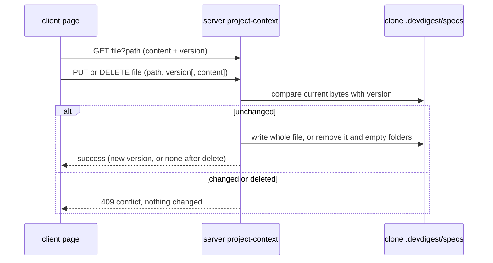

# Spec: Project Context authoring and picker polish
Spec ID: SPEC-2026-10-01-project-context-authoring
Status: approved
Supersedes: SPEC-2026-09-29-project-context
Packages: server, client

## Problem and user
A reviewer who wants an agent grounded in a spec can only attach Markdown that is already in the
repo's clone. A PRD or acceptance list that lives on their machine, or exists only as an idea,
cannot become project context. The only workaround is to commit it upstream and resync, or to
paste the text into a skill body, where it goes stale. In the agent and skill editors, the same
reviewer previews a document in a modal that cannot attach it. They see only a total token figure,
with no per-document cost and no budget warning. The skill's SERIALIZES AS box lists bare paths.
This spec supersedes SPEC-2026-09-29-project-context **only** where listed here, and answers its
Q-1, Q-2, Q-6 and Q-8. It overrides exactly:
- its non-goal on editing, creating, uploading and deleting files;
- its AC-10 SERIALIZES AS wording (AC-16 here);
- its preview modal (AC-12 here);
- for paths under `.devdigest/specs/` only, its EC-8 "in the repo's current listing" check (EC-11 here).

Every criterion of the earlier spec that is not overridden here still holds, and the planner plans
against all of them.
**Request vs tree:** matches, with five details.
- (1) The clone is treated as a read-only mirror. Nothing writes to it, and every resync runs
  `reset --hard` (`server/src/adapters/git/simple-git.ts:77-87`).
- (2) Files under `.devdigest/specs/` are already listed and classed `specs`. The walk skips only
  `.git` and `node_modules` (`server/src/modules/project-context/constants.ts:5`), and a `specs`
  segment gives the kind (`server/src/modules/project-context/helpers.ts:8`).
- (3) The listing already carries a per-document `tokens` (`server/src/modules/project-context/service.ts:34`),
  but the picker shows only the total (`client/src/components/context-docs-picker/ContextDocsPicker.tsx:159`).
- (4) A document can be read only when it is among the first 500 listed paths
  (`server/src/modules/project-context/service.ts:43-46`).
- (5) The listing is sorted by path (`server/src/modules/project-context/repository-files.ts:60`).
  `.` sorts before digits and letters, so `.devdigest/` lands near the top. Only names starting with
  `!` to `-`, and dot-folders that sort before it (such as `.changeset/`, `.claude/`), come first.
  The 500 cap therefore rarely reaches authored files.

## Goals / Non-goals
**Goals**
- The reviewer creates, edits, uploads and deletes Markdown documents under `<clone>/.devdigest/specs/`
  from the Project Context page. Every other clone document stays read-only.
- An edit is never lost silently. Saving and deleting are explicit, unsaved work is guarded, and a
  write or delete over a newer version is refused.
- The picker previews in a drawer that can attach. It shows each document's token cost and warns
  above a 4,000-token soft cap.
- SERIALIZES AS shows the heading actually injected, then the attached paths in injection order,
  each with its kind.

**Non-goals**
- Renaming or moving files (author's answer, 2026-10-01).
- Detecting an upstream collision before a resync. It stays a documented limitation (author's answer, 2026-10-01).
- The Re-index action with its chunk and embedding footer (spec 2026-09-29, Q-4). The coverage ring
  (Q-3 there), the "Skills loaded" trace chips (Q-5 there), CI and MCP visibility (Q-9 there).
- Committing or pushing authored documents upstream. Changes to `reviewer-core` or the injected prompt.

## User stories
- **US-1** As a reviewer, I want to create, edit and delete spec documents for a repo in DevDigest, so that agents are grounded in specs the repo does not hold yet.
- **US-2** As a reviewer, I want to upload a Markdown file from my machine into the repo's spec folder, so that I can reuse a PRD I already have.
- **US-3** As a reviewer, I want explicit saving, a warning before unsaved edits are lost, and a refusal to overwrite a newer version, so that I never lose text silently.
- **US-4** As a reviewer, I want to preview a document from the picker, see its token cost and attach it from the preview, so that I choose documents without leaving the editor.
- **US-5** As a reviewer, I want a warning when the attached set exceeds a token budget, and a truthful view of how it serializes, so that I know what a run's prompt will contain.

## Acceptance criteria (EARS)
- **AC-1** The Project Context page shall show: the breadcrumb `<owner/repo>` › Project Context › `<selected path>`, with the last segment only while a file is selected; the root path `.devdigest/specs/` in its left pane header; a toolbar of New file, New folder, Upload and Refresh, in that order, where Refresh re-reads the listing (AC-16 of the earlier spec); and a note that files there exist only in the local clone and that a file at the same path committed upstream replaces them on the next sync. · traces: US-1, DR-4, DR-20 · verify: component
- **AC-2** WHEN the user activates New file or New folder and confirms a name (pre-filled with `untitled.md` or `new-folder`), the system shall create `.devdigest/specs/<name>` with the body `# Untitled spec\n\n## Goals\n- `, or `.devdigest/specs/<name>/spec.md` with the body `# New folder spec\n`. · traces: US-1, DR-1, DR-22 · verify: integration
- **AC-3** WHEN the user uploads a `.md` file, the system shall write its bytes unchanged to `.devdigest/specs/<uploaded name>`, in the root and never in a subfolder. · traces: US-2, DR-1 · verify: integration
- **AC-4** WHEN a create or an upload succeeds, the page shall select the new file, in Edit mode after a create and in Preview mode after an upload. · traces: US-1, US-2 · verify: component
- **AC-5** WHILE an editable file is selected, the page shall offer a Preview | Edit control and a Delete action. Edit shall show the text in a monospace text area. Preview shall render the current text, including unsaved edits, as Markdown. · traces: US-1, DR-4 · verify: component
- **AC-6** WHILE a read-only file is selected, the page shall show Preview only, with no Edit and no Delete. It shall show a "read-only" label that states the reason: outside `.devdigest/specs/`, tracked by the repository, or over 64 KB. · traces: US-1, DR-3 · verify: component
- **AC-7** WHILE the edited text differs from the last loaded or saved text, the page shall show an "Unsaved changes" text indicator and enable Save. · traces: US-3, DR-5 · verify: component
- **AC-8** WHEN the user activates Save, the system shall write the text with LF line endings, but only if the file is byte-identical to the version the page loaded. The page shall then show the saved state, and the listing shall show the new size and token count. · traces: US-3, DR-2 · verify: integration
- **AC-9** WHEN the user, with unsaved changes, selects another file, deletes the open file, or leaves the page (in-app navigation, reload or closing the tab), the page shall ask for confirmation. It shall keep the edits if the user cancels. · traces: US-3, DR-5 · verify: component
- **AC-10** WHEN the user activates Delete on an editable file and confirms, the system shall remove the file only if it is byte-identical to the version the page loaded, remove every folder under `.devdigest/specs/` that the delete leaves empty (never the root itself), drop the file from the listing and clear the selection. · traces: US-1, DR-23 · verify: integration
- **AC-11** WHEN the user activates Preview on a picker row, the picker shall open a 560 px right-side drawer in place of the modal. The drawer shall show the full path, the kind badge, "Used by N agent(s)", the token count and the rendered document, read-only. · traces: US-4, DR-6 · verify: component
- **AC-12** WHEN the user activates Attach or Attached in the drawer, the system shall attach or detach the document exactly as the row checkbox does. The drawer button and the checkbox shall then show the same state. · traces: US-4, DR-6 · verify: component
- **AC-13** The picker shall show each readable row's token count, written as `1.2K` from 1,000 upward. · traces: US-4, DR-7 · verify: component
- **AC-14** WHILE the total tokens of the documents attached on that tab exceed 4,000, the picker shall show the total in the critical colour beside a text badge "over 4K soft cap". This is the same total as AC-9 of the earlier spec. · traces: US-5, DR-8 · verify: component
- **AC-15** WHEN the cloned repo has no `.md` file, the page shall show "No spec files yet" with an "Add a spec file" action that performs New file, and the picker shall show "No documents found" with a Refresh action that re-reads the listing; both bodies shall say that only `.md` files are listed. · traces: US-1, US-4, DR-4 · verify: component
- **AC-16** The skill's SERIALIZES AS box shall start with the injected heading `## Project context`. It shall then list the attached paths in attach order, which is the injection order, as a flat list. Each line shall carry its kind as a text label, for example `- [specs] .devdigest/specs/x.md`. The box shall contain no other `##` line. · traces: US-5, DR-9 · verify: component

## Edge cases
- **EC-1** IF the repo has no clone, THEN the page shall disable New file, New folder and Upload, and the system shall reject any write or delete with 409 and change nothing. · traces: DR-11 · verify: integration
- **EC-2** IF an entered or uploaded name is already taken in its folder (compared case-insensitively), THEN the system shall append `-2`, `-3`, … before `.md`, or after a folder name, until the name is free, and shall never overwrite an existing file. · traces: DR-12 · verify: integration
- **EC-3** IF a write or delete names a path that is absolute, contains `..` or an empty segment, lies outside `.devdigest/specs/` or does not end in `.md`, or an entered or uploaded name that is invalid on Windows or POSIX (a reserved device name CON, PRN, AUX, NUL, COM1–COM9, LPT1–LPT9 in any case and with any extension; one of `< > : " / \ | ? *` or U+0000–U+001F; a trailing dot or space; more than 255 bytes), THEN the system shall reject it with 422 naming the field and change nothing. · traces: DR-13 · verify: unit
- **EC-4** IF `.devdigest`, `.devdigest/specs` or any folder on the target path is a symlink, a junction or not a directory, THEN the system shall refuse the write or delete with 422 and leave the link target untouched. A clone root that is itself reached through a junction shall stay writable. · traces: DR-17 · verify: integration
- **EC-5** IF content to be written exceeds 65,536 bytes as UTF-8, is not valid UTF-8, or contains a NUL byte, THEN the system shall reject it with 422 naming the rule and write nothing. · traces: DR-13 · verify: integration
- **EC-6** IF the file changed or was deleted on disk after the page loaded it (another tab, a resync, an outside editor), THEN the system shall reject the save or delete with 409 and leave the disk as it is. · traces: DR-14 · verify: integration
- **EC-7** WHEN a save or delete is rejected as a conflict, the page shall keep the user's text, say the file changed or no longer exists, and offer Reload (discards the user's text after confirmation) and, after a rejected save, Overwrite (writes the user's text over the current version). · traces: DR-14 · verify: component
- **EC-8** WHILE a save or delete request is in flight, the page shall disable Save and Delete and show progress, so that a double activation sends one request. · traces: DR-15 · verify: component
- **EC-9** IF a save or delete fails for any reason other than a conflict, THEN the page shall keep the file, the text and the "Unsaved changes" indicator, and show an error with a retry action. · traces: DR-15 · verify: component
- **EC-10** IF a file under `.devdigest/specs/` is tracked in the clone's current commit, or is larger than 64 KB, THEN the system shall reject a save or delete of it with 422. The page shall show it read-only (AC-6). · traces: DR-16 · verify: integration
- **EC-11** IF the clone has more than 500 `.md` files, THEN the listing shall stay capped at the first 500 by path with "showing 500 of N" (EC-3 and NFR-1 of the earlier spec), while preview, save, delete and attach of a path under `.devdigest/specs/` shall be accepted when it passes EC-3 and EC-4 and exists on disk, whether or not it is among the 500; a file created or uploaded past the cap shall stay selected and editable, in a row pinned above the list labelled "not in the first 500", until another file is selected. · traces: DR-10 · verify: integration
- **EC-12** WHEN a document attached to an agent or a skill is saved or deleted, the next run shall inject the saved text and show it in Prompt assembly, or skip the deleted document and name it in the run log (EC-4 of the earlier spec) while the Context tabs show it as a "missing" row (EC-7 there); a run already in progress shall keep what it read at its start. · traces: DR-18 · verify: integration
- **EC-13** IF a row's token count is unavailable because the file cannot be read, THEN the picker shall show "—" with the accessible name "token count unavailable" and leave the row out of the total. · traces: DR-19 · verify: component

## Design review
**Source:** specs/designs/project-context/05-project-context-authoring.md (behaviour and layout),
with 01–04 where 05 is silent. Design 05 shows only the populated and empty states and leaves
persistence, dirty state and conflicts to the spec (05:40-42). The other states were checked
against the tree. On a narrow viewport the existing drawer caps its width at 94%
(`client/src/vendor/ui/kit/Drawer.tsx:30`).
### Gaps
- **DR-1** Writing to the clone: no route writes, and the reader only reads (`server/src/modules/project-context/repository-files.ts:75-103`). The clone is a mirror (`server/src/adapters/git/simple-git.ts:77-80`).
- **DR-2** Version token for optimistic concurrency: `SpecFile` has none (`server/src/vendor/shared/contracts/platform.ts:258-266`).
- **DR-3** Editability: nothing tells a writable document from a read-only one (same contract).
- **DR-4** Page chrome and empty states: the page is read-only.
  - It has no Preview | Edit, no create or upload actions and no root label, and the crumb is Workspace › Project Context (`client/src/app/repos/[repoId]/context/_components/ProjectContextView/ProjectContextView.tsx:1-3`, `:22`, `:91`).
  - Neither empty state has an action (`ProjectContextView.tsx:43-44`, `client/src/components/context-docs-picker/ContextDocsPicker.tsx:61-63`).
- **DR-5** Unsaved-changes guard: no client surface has one (no dirty or before-unload handling under `client/src`).
- **DR-6** Preview is a modal with no attach action (`client/src/components/context-docs-picker/DocPreviewModal.tsx:1-15`, `ContextDocsPicker.tsx:162`).
- **DR-7** Per-row tokens are fetched but not shown (`ContextDocsPicker.tsx:141-153`).
- **DR-8** No soft cap on the total (`ContextDocsPicker.tsx:159`).
- **DR-9** SERIALIZES AS is a bare path list with no heading and no kind (`client/src/app/skills/[id]/_components/SkillEditor/_components/ContextTab/ContextTab.tsx:37-43`).
  - The engine injects one `## Project context` heading and the documents in attach order (`reviewer-core/src/prompt.ts:147`, `server/src/modules/project-context/helpers.ts:15`).
  - The design's per-source headings and grouping would therefore misstate both the heading and the order.
- **DR-10** A document past the 500-file cap cannot be read today (`server/src/modules/project-context/service.ts:43-46`).
### Uncovered cases
- **DR-11** Repo not cloned while authoring → EC-1
- **DR-12** Name collision on an entered or uploaded name (05:25 covers create only) → EC-2
- **DR-13** Invalid path, name, size or encoding → EC-3, EC-5
- **DR-14** Concurrent edit from two tabs, or a resync during an edit → EC-6, EC-7
- **DR-15** Double Save or Delete, and a request interrupted by an error → EC-8, EC-9
- **DR-16** Tracked or oversized file under the root → EC-10
- **DR-17** Symlinked or non-directory root → EC-4
- **DR-18** Editing or deleting a document that agents already use → EC-12
- **DR-19** Unreadable row (`tokens: null`, `service.ts:34`) → EC-13
- **DR-20** Upstream later commits a file at an authored path → AC-1, NFR-2
- **DR-21** Keyboard-only use of the segmented control, the toolbar and the drawer → NFR-6
### Module interactions
| From | To | Through | Contract |
|---|---|---|---|
| `client` Project Context page, picker drawer | `server` `modules/project-context` | `GET /repos/:id/context` | `ContextFileList` / `SpecFile` in server/src/vendor/shared/contracts/platform.ts · existing, extended with editability and read-only reason |
| `client` page (Edit, conflict reload), drawer | `server` `modules/project-context` | `GET /repos/:id/context/file?path=` | `SpecFile` · existing, extended with a version token |
| `client` page Save, Overwrite | `server` `modules/project-context` | `PUT /repos/:id/context/file` | `ContextFileSave` (path, content, version) → `SpecFile`; 409 conflict body · new |
| `client` page Delete | `server` `modules/project-context` | `DELETE /repos/:id/context/file` | `ContextFileDelete` (path, version) → empty success; 409 conflict body · new |
| `client` page New file, New folder | `server` `modules/project-context` | `POST /repos/:id/context/files` | `ContextFileCreate` (kind: file or folder, name) → `SpecFile` · new |
| `client` page Upload | `server` `modules/project-context` | `POST /repos/:id/context/upload` | `ContextFileUpload` (name, content bytes) → `SpecFile` · new |
| `client` drawer Attach | `server` `modules/project-context` | `PUT /agents/:id/context`, `PUT /skills/:id/context` | `ContextAttachments` · existing |
| `server` `modules/project-context` | `server` git adapter | DI container, "is this path tracked at HEAD" | none (in-process) · new |

### UX improvements
- **DR-22** *adopted 2026-10-01 (answer to Q-2)*: New file and New folder ask for a name, pre-filled with `untitled.md` or `new-folder`, instead of using fixed names. EC-2 and EC-3 apply to the entered name → AC-2.
- **DR-23** *adopted 2026-10-01 (answer to Q-3)*: a Delete action for editable files, which the design's toolbar does not have. Empty folders left behind are removed, and the root itself is kept → AC-5, AC-10.

## Non-functional requirements
- **NFR-1** Size: written content is at most 65,536 bytes, the reader's cap (`server/src/modules/project-context/constants.ts:4`), so an authored document is previewed and injected whole. A request stays under the API's 1 MiB body limit (`server/src/app.ts:49`). · verify: integration
- **NFR-2** Data retention: authored documents exist only in the clone working tree. DevDigest never stores their text in Postgres, never commits and never pushes them. An untracked authored file survives a resync. A file at the same path that the upstream later commits replaces it on the next resync, and this is a documented limitation that DevDigest does not detect. · verify: integration
- **NFR-3** Isolation: files under the root never appear in a PR diff or in the repo-intel index, and are never read by Onboarding or Conventions. · verify: integration
- **NFR-4** Concurrency: two simultaneous creates produce two distinct files, and a reader of a file being saved sees the old or the new content, never a mix. · verify: integration
- **NFR-5** Compatibility: `reviewer-core` and `INJECTION_GUARD` are unchanged, and a run with the same documents sends a byte-identical prompt. Contract changes are additive and mirrored in the client's vendored copy. · verify: static
- **NFR-6** Accessibility: toolbar actions have accessible names. Preview | Edit is keyboard-operable and exposes its selected state. Unsaved, conflict, read-only and over-cap states are stated in text, not colour alone. The drawer closes on Escape and returns focus to the Preview action that opened it. · verify: component
- **NFR-7** i18n: every new string comes from `client/messages/en/context.json`. · verify: static
- **NFR-8** Cost: authoring, preview and the soft cap make no LLM call. The drawer takes tokens and "Used by" from the listing it already has. · verify: integration
- **NFR-9** Observability: every write and delete logs one line with repo id, path, byte count and outcome (created, saved, uploaded, deleted, conflict, rejected), never the content. · verify: integration
- **NFR-10** Soft cap: exceeding 4,000 tokens never disables attaching and never changes what a run injects. · verify: component

## Traceability
| Requirement | Traces to | Verify how |
|---|---|---|
| AC-1 | US-1, DR-4, DR-20 | component |
| AC-2 | US-1, DR-1, DR-22 | integration |
| AC-3 | US-2, DR-1 | integration |
| AC-4 | US-1, US-2 | component |
| AC-5 | US-1, DR-4, DR-23 | component |
| AC-6 | US-1, DR-3 | component |
| AC-7 | US-3, DR-5 | component |
| AC-8 | US-3, DR-2 | integration |
| AC-9 | US-3, DR-5 | component |
| AC-10 | US-1, DR-23 | integration |
| AC-11 | US-4, DR-6 | component |
| AC-12 | US-4, DR-6 | component |
| AC-13 | US-4, DR-7 | component |
| AC-14 | US-5, DR-8 | component |
| AC-15 | US-1, US-4, DR-4 | component |
| AC-16 | US-5, DR-9 | component |
| EC-1 | DR-11 | integration |
| EC-2 | DR-12 | integration |
| EC-3 | DR-13 | unit |
| EC-4 | DR-17 | integration |
| EC-5 | DR-13 | integration |
| EC-6 | DR-14 | integration |
| EC-7 | DR-14 | component |
| EC-8 | DR-15 | component |
| EC-9 | DR-15 | component |
| EC-10 | DR-16 | integration |
| EC-11 | DR-10 | integration |
| EC-12 | DR-18 | integration |
| EC-13 | DR-19 | component |
| NFR-1 | US-1, US-2 | integration |
| NFR-2 | US-1, DR-20 | integration |
| NFR-3 | US-1 | integration |
| NFR-4 | US-3 | integration |
| NFR-5 | US-5 | static |
| NFR-6 | US-4, DR-21 | component |
| NFR-7 | US-1 | static |
| NFR-8 | US-4 | integration |
| NFR-9 | US-1, US-3 | integration |
| NFR-10 | US-5 | component |

## Inputs and provenance
| Source | Path or URL | What it settled |
|---|---|---|
| request | coordinator brief, 2026-10-01 | Follow-up to SPEC-2026-09-29-project-context, which is not edited. Lists the edge cases to cover. |
| answers | "Scope: (a) Edit mode + New file; (b) New folder + Upload; (c) picker polish … Out of scope: Re-index … coverage ring … Skills loaded … CI/MCP" | Goals, non-goals, AC-1 to AC-16 |
| answers | "documents are written into … `<clone>/.devdigest/specs/` … all other `.md` files … remain read-only" | AC-1, AC-6, EC-3, EC-10 |
| answers | "explicit Save with a dirty indicator and a guard … server rejects a write when the file changed since it was read" | AC-7 to AC-9, EC-6 to EC-9 |
| answers | Q-1: "yes. Set `Supersedes: SPEC-2026-09-29-project-context` … list exactly what is overridden … The planner must still plan against all other criteria of the earlier spec." | Header, override list in Problem and user |
| answers | Q-2: "adopt DR-22 … pre-filled with `untitled.md` or `new-folder` … EC-2 … and EC-3 … apply to the entered name" | DR-22, AC-2, EC-2, EC-3 |
| answers | Q-3: "Delete is in scope; rename stays out … confirmation and a version token … stale version gets 409 … Decide … whether empty folders left behind are removed" | DR-23, AC-5, AC-6, AC-9, AC-10, EC-1, EC-3, EC-4, EC-6 to EC-10, EC-12, NFR-9; empty folders are removed and the root is kept |
| answers | Q-4: "keep it as a documented limitation (page note plus NFR-2). No detection." | AC-1, NFR-2, non-goals |
| answers | Q-5: "keep the default, the tab's own attachments" | AC-14 |
| answers | Q-6: "accept CRLF → LF on save. Upload keeps the bytes unchanged." | AC-8, AC-3 |
| answers | Q-7: "an upload always goes to the root" | AC-3 |
| answers | Contradiction fixes 1–4 (SERIALIZES AS in attach order as a flat list; the 500 cap kept; a Refresh action, not Re-index; empty states name `.md`) | AC-16, DR-9, EC-11, AC-1, AC-15, Request vs tree (5) |
| research | researcher report "What `git reset --hard origin/<branch>` does to untracked and ignored files under `.devdigest/specs/`" (2026-10-01; git-scm.com/docs/git-reset, git v2.34.0 to v2.53.0 docs and source) | Untracked and ignored files survive `reset --hard`. A tracked edit is discarded. An untracked file, ignored or not, at a path the upstream commits is overwritten silently, and a folder is deleted when the upstream commits a file at its path. Nothing calls `git clean`. `diff A...B` excludes the working tree. → EC-10, NFR-2, NFR-3 |
| design | specs/designs/project-context/05-project-context-authoring.md | Toolbar, templates, `-2` suffix, Preview/Edit, empty states, drawer, soft cap |
| design | specs/designs/project-context/01..04-*.png | Layout where 05 is silent |
| repo | server/src/adapters/git/simple-git.ts:61-64, :77-87 | Resync is `reset --hard`. A clone dir is removed only when it has no `.git`. No `git clean` call under `server/src`. |
| repo | server/src/modules/reviews/diff-loader.ts:20 · server/src/modules/repo-intel/constants.ts:13 | Review diff is commit-to-commit; the indexer parses only `.ts/.js` variants → NFR-3 |
| repo | server/src/modules/onboarding/repository-files.ts:50-60 · server/src/modules/conventions/repository-samples.ts:31 | Onboarding reads allow-listed root files only; Conventions skips dot-folders → NFR-3 |
| repo | server/src/modules/project-context/repository-files.ts:60, :70-99 | Listing sorted by path; existing traversal, realpath and NUL guards, and the 64 KB cap that writes align with |
| repo | server/src/modules/skills/routes.ts:57 | Precedent for a file upload carried in a JSON body |
| insights | server/INSIGHTS.md:106-112 | A clone dir behind a junction is legitimate, so containment compares real paths on both sides → EC-4 |
| insights | INSIGHTS.md:361-366 | A worktree dev server resolves `clone_path` against its own checkout, so authored files live where the DB's clone path points → NFR-2 |
| insights | INSIGHTS.md:276 | Contracts are vendored twice; mirror in the same change → NFR-5 |

## Untrusted inputs
| Input | Source | Validation | On invalid |
|---|---|---|---|
| Entered name (create) and upload file name | form field; user's machine via the browser | Shape and bounds: 1–255 bytes, the EC-3 name rules; a file name ends in `.md` (any case) | 422 naming `name`; nothing written |
| Upload content | user's file | Size and rate: at most 65,536 bytes; valid UTF-8; no NUL byte | 422 naming `content`; nothing written |
| Save body (path, content, version) | HTTP `PUT` | Shape and bounds: strict object; path is a `.md` path under `.devdigest/specs/` with no absolute form, `..` or empty segment; content at most 65,536 bytes; version a bounded string | 422 naming the field; a stale version → 409, nothing written |
| Delete request (path, version) | HTTP `DELETE` | Shape and bounds: strict object; same path rules as Save; version a bounded string; target untracked and within 64 KB | 422 naming the field; a stale version → 409; nothing removed |
| Create body (kind, name) | HTTP `POST` | Shape and bounds: strict object, kind is `file` or `folder`, name as above | 422 naming the field |
| Repo `:id` | HTTP params | Identity: resolves to a repo in the caller's workspace | 404, indistinguishable from "does not exist" |
| Clone layout (symlinks, junctions, tracked files) | upstream repo contents in the repo's clone | Paths: the real path of the target stays under the real clone root; no link on the target path | Write or delete refused with 422; link target untouched |
| Document text in Edit and Preview | clone file or user's typing | Text that is rendered: the existing Markdown renderer only; the editor is plain text | Raw HTML shown as text |
| Authored text reaching a prompt | clone file | Text that reaches a prompt: wrapped as untrusted exactly as today | An instruction inside it is data, never followed |

## Open questions
- **Q-1 (non-blocking):** The picker shows the capped listing, so it cannot offer a file under `.devdigest/specs/` that falls past the 500 cap. Attaching such a file works only through the API (EC-11). `.devdigest/` sorts near the top (Request vs tree, 5), so this should be rare. — the author decides; this draft accepts it.
